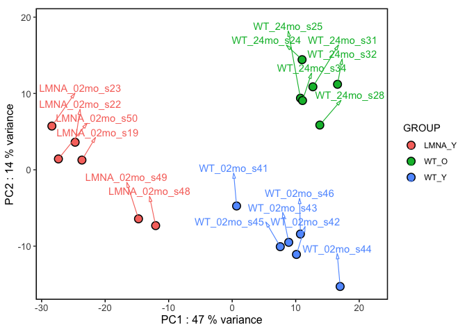
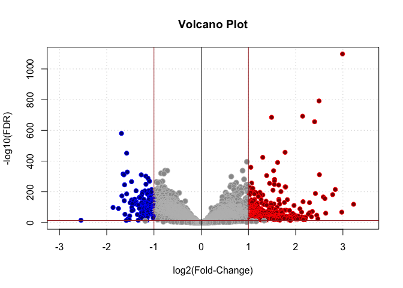
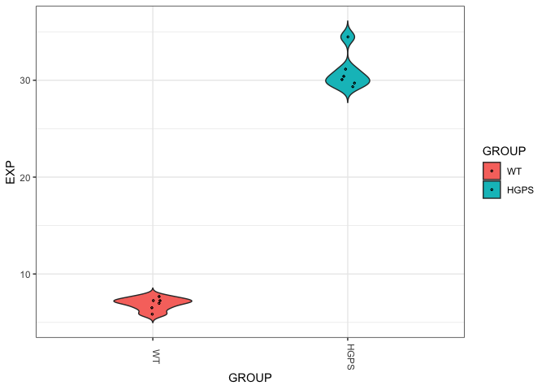
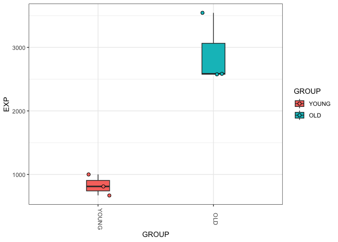
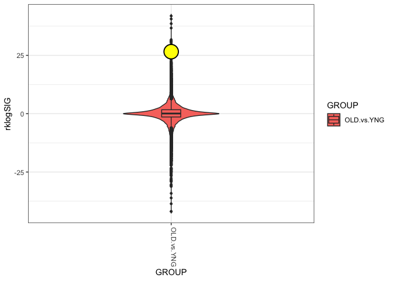
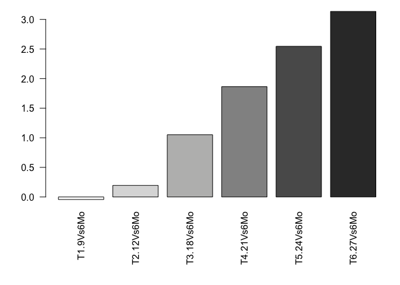

README
================
BOLIS M
2023-11-02

## Aditional information

This R Markdown document contains code to reproduce the analyses
performed in our manuscript entitled **Increase of
Ectodysplasin-A2-Receptor EDA2R is a ubiquitous aging-related
transcriptional hallmark** from *Barbera et al*.

### <br>

### Loading required libraries

``` r
neededlibraries = c("tibble", "ggsankey", "ggplot2", "ggrepel", "grid", "CePa", "DESeq2", "edgeR", "limma", "org.Hs.eg.db", "org.Mm.eg.db", "org.Rn.eg.db", "gghalves", "gcrma", "GEOquery", "umap")
lapply(neededlibraries, require, character.only = TRUE)
```

### <br>

### Composition of the GTEX v8 data

Here we read the annotations of all various GTEX samples available. In
particular, indicated are the tissue type of origin (SMTS), the exact
anatomical location (SMUBRTRM) and GENDER. In downstream analysis,
correlations will be performed separately by anatomical location, while
SMUBRTRM and GENDER will be used to correct biological batch and reduce
tissue-variability.

``` r
gtex_info = read.table("./data/gtex_info.tsv", sep = "\t", header = T)
gtex_info = gtex_info[order(gtex_info$SMTS, gtex_info$SMUBRTRM),]
factor_reorder <- unique(
  c(rev(sort(unique(gtex_info$SMTS))), rev(unique(gtex_info$SMUBRTRM)), rev(sort(unique(gtex_info$SEX))))
)
gtex_info_long = make_long(gtex_info, SMTS, SMUBRTRM, SEX)
gtex_info_long$node <- factor(gtex_info_long$node, levels = factor_reorder)
p = ggplot(gtex_info_long, aes(x = x, 
              next_x = next_x, 
              node = node, 
              next_node = next_node,
              fill = factor(node),
              label = node)) +
  geom_sankey(flow.alpha = 0.5, node.color = 1) +
  geom_sankey_label(size = 1.5, color = 1, fill = "white") +
  scale_fill_viridis_d(option = "A", alpha = 0.95) +
  scale_x_discrete(expand = c(0.05,0)) +  # This line removes the padding on the x-axis
  theme_sankey(base_size = 12) +
  theme(axis.title.x=element_blank(), legend.position = "none")
print(p)
```


### <br>

### Association between gene-expression and age across tissues

Here we provide code used to normalize, batch-correct and perform
correlations. Exemplified is the adipose tissue, and the same strategy
was applied in all tissue-types.  
Batch adjustment for *SMUBRTRM* and *GENDER* is achieved by providing a
design matrix to preserve age-associated transcriptional differences as
correction is performed.

Please consider that the **exact age** of individuals is <u>**not
publicly available**</u> from GTEX, and access needs to be requested to
dbGap. Therefore, annotation file is not provided for this step.
However, analysis results are included within our repository and can be
used for downstream analysis (correlation coefficients/p-values).

##### <br>

##### Import and normalize data (adipose tissue)

``` r
adipose_samples = read.table(file = "./data/adipose_samples.txt", sep = "\t", header = T, row.names = 1)
adipose_rawcounts = read.table(file = "./data/adipose_rawcounts.txt", sep = "\t", header = T, row.names = 1, check.names = F)
adipose.rawcounts = adipose_rawcounts[,rownames(adipose_samples)]

adipose.dds <- DESeqDataSetFromMatrix(countData = adipose.rawcounts, colData = adipose_samples, design =  ~ 1)
adipose.vst <- vst(adipose.dds, blind = TRUE)
adipose.assay <- assay(adipose.vst)
```

##### <br>

##### Define color scales for graphical representation of batches (adipose tissue)

``` r
SMUBRTRM = adipose_samples[colnames(adipose.vst),]$SMUBRTRM
SMUBRTRM.colors = rep("white", length(names(table(adipose_samples$SMUBRTRM))))
names(SMUBRTRM.colors) = names(table(adipose_samples$SMUBRTRM))
SMUBRTRM.palette <- setNames(
  c("yellow", "red"),
  c("omental fat pad", "subcutaneous adipose tissue")
)
SMUBRTRM.colors[names(SMUBRTRM.palette)] = SMUBRTRM.palette

SEX = adipose_samples[colnames(adipose.vst),]$SEX
SEX.colors = rep("white", length(names(table(adipose_samples$SEX))))
names(SEX.colors) = names(table(adipose_samples$SEX))
SEX.palette <- setNames(
  c("blue", "pink"),
  c("M", "F")
)
SEX.colors[names(SEX.palette)] = SEX.palette

ntop = 1000
rv = rowVars(adipose.assay)
topvar = rownames(adipose.assay)[order(rv, decreasing = TRUE)[seq_len(ntop)]]
pca = prcomp( t(assay(adipose.vst[topvar,])) )
percentVar <- round(100* pca$sdev^2/sum(pca$sdev^2) )
pca = data.frame(PC1 = pca$x[,1], PC2 = pca$x[,2], SMUBRTRM = SMUBRTRM, SEX = SEX)

SMUBRTRM.colscale = rep(NA, nrow(pca))
for(i in 1:length(SMUBRTRM.colors)){
  SMUBRTRM.colscale[which(pca$SMUBRTRM==names(SMUBRTRM.colors)[i])] = SMUBRTRM.colors[i]
}

SEX.colscale = rep(NA, nrow(pca))
for(i in 1:length(SEX.colors)){
  SEX.colscale[which(pca$SEX==names(SEX.colors)[i])] = SEX.colors[i]
}
```

##### <br>

##### Unadjusted PCA colored by SMUBRTRM, SEX (adipose tissue)

``` r
p1 <- ggplot(pca, aes(PC1, PC2, color=SMUBRTRM, shape=NULL)) +
      geom_point(size=3.5, aes(fill=I(SMUBRTRM.colscale) ), colour="black",pch=21, stroke = 0.8) + 
      xlab(paste0("PC1 : ",percentVar[1]," % variance")) +
      ylab(paste0("PC2 : ",percentVar[2]," % variance")) +
      coord_fixed(ratio = 1) + 
      theme(legend.position = "none") +
      theme(panel.grid = element_blank(), panel.background = element_rect(fill = NA, colour = "black", size = 1), axis.text=element_text(size=10, face="plain"), axis.title=element_text(size=12,face="plain",family = "Arial"), axis.ticks.x = element_line(colour = "black"))

p2 <- ggplot(pca, aes(PC1, PC2, color=SEX, shape=NULL)) +
  geom_point(size=3.5, aes(fill=I(SEX.colscale) ), colour="black",pch=21, stroke = 0.8) + 
  xlab(paste0("PC1 : ",percentVar[1]," % variance")) +
  ylab(paste0("PC2 : ",percentVar[2]," % variance")) +
  coord_fixed(ratio = 1) + 
  theme(legend.position = "none") +
  theme(panel.grid = element_blank(), panel.background = element_rect(fill = NA, colour = "black", size = 1), axis.text=element_text(size=10, face="plain"), axis.title=element_text(size=12,face="plain",family = "Arial"), axis.ticks.x = element_line(colour = "black"))

pcaplot = list()
pcaplot$p1 = p1
pcaplot$p2 = p2

gridExtra::grid.arrange(grobs = pcaplot, nrow = 1, ncol = 2, gp = gpar(fontsize = 28, font = 2))
```


##### <br>

##### Adjusting for SMUBRTRM (adipose tissue)

Transcriptional differences associated to **SEX** and **AGE** <u>will be
preserved</u> when adjusting for **SMUBRTRM**.

``` r
batchcov_step1 = model.matrix(~ 0 + AGE + SEX, data = adipose_samples)
assay(adipose.vst) <- removeBatchEffect(x = assay(adipose.vst), batch = adipose_samples[colnames(adipose.vst),]$SMUBRTRM, design = batchcov_step1)

pca_adjusted_1 = prcomp( t(assay(adipose.vst[topvar,])) )
percentVar <- round(100* pca_adjusted_1$sdev^2/sum(pca_adjusted_1$sdev^2) )
pca_adjusted_1 = data.frame(PC1 = pca_adjusted_1$x[,1], PC2 = pca_adjusted_1$x[,2], SMUBRTRM = SMUBRTRM, SEX = SEX)

p3 <- ggplot(pca_adjusted_1, aes(PC1, PC2, color=SMUBRTRM, shape=NULL)) +
  geom_point(size=3.5, aes(fill=I(SMUBRTRM.colscale) ), colour="black",pch=21, stroke = 0.8) + 
  xlab(paste0("PC1 : ",percentVar[1]," % variance")) +
  ylab(paste0("PC2 : ",percentVar[2]," % variance")) +
  coord_fixed(ratio = 1) + 
  theme(legend.position = "none") +
  theme(panel.grid = element_blank(), panel.background = element_rect(fill = NA, colour = "black", size = 1), axis.text=element_text(size=10, face="plain"), axis.title=element_text(size=12,face="plain",family = "Arial"), axis.ticks.x = element_line(colour = "black"))

p4 <- ggplot(pca_adjusted_1, aes(PC1, PC2, color=SEX, shape=NULL)) +
  geom_point(size=3.5, aes(fill=I(SEX.colscale) ), colour="black",pch=21, stroke = 0.8) + 
  xlab(paste0("PC1 : ",percentVar[1]," % variance")) +
  ylab(paste0("PC2 : ",percentVar[2]," % variance")) +
  coord_fixed(ratio = 1) + 
  theme(legend.position = "none") +
  theme(panel.grid = element_blank(), panel.background = element_rect(fill = NA, colour = "black", size = 1), axis.text=element_text(size=10, face="plain"), axis.title=element_text(size=12,face="plain",family = "Arial"), axis.ticks.x = element_line(colour = "black"))

pcaplot = list()
pcaplot$p3 = p3
pcaplot$p4 = p4

gridExtra::grid.arrange(grobs = pcaplot, nrow = 1, ncol = 2, gp = gpar(fontsize = 28, font = 2))
```


<br>

##### Adjusting for SEX (adipose tissue)

Transcriptional differences associated to **AGE** <u>will be
preserved</u> when adjusting for **SEX**.

``` r
batchcov_step2 = model.matrix(~ 0 + AGE, data = adipose_samples)
assay(adipose.vst) <- removeBatchEffect(x = assay(adipose.vst), batch = adipose_samples[colnames(adipose.vst),]$SEX, design = batchcov_step2)

pca_adjusted_2 = prcomp( t(assay(adipose.vst[topvar,])) )
percentVar <- round(100* pca_adjusted_2$sdev^2/sum(pca_adjusted_2$sdev^2) )
pca_adjusted_2 = data.frame(PC1 = pca_adjusted_2$x[,1], PC2 = pca_adjusted_2$x[,2], SMUBRTRM = SMUBRTRM, SEX = SEX)

p5 <- ggplot(pca_adjusted_2, aes(PC1, PC2, color=SMUBRTRM, shape=NULL)) +
  geom_point(size=3.5, aes(fill=I(SMUBRTRM.colscale) ), colour="black",pch=21, stroke = 0.8) + 
  xlab(paste0("PC1 : ",percentVar[1]," % variance")) +
  ylab(paste0("PC2 : ",percentVar[2]," % variance")) +
  coord_fixed(ratio = 1) + 
  theme(legend.position = "none") +
  theme(panel.grid = element_blank(), panel.background = element_rect(fill = NA, colour = "black", size = 1), axis.text=element_text(size=10, face="plain"), axis.title=element_text(size=12,face="plain",family = "Arial"), axis.ticks.x = element_line(colour = "black"))

p6 <- ggplot(pca_adjusted_2, aes(PC1, PC2, color=SEX, shape=NULL)) +
  geom_point(size=3.5, aes(fill=I(SEX.colscale) ), colour="black",pch=21, stroke = 0.8) + 
  xlab(paste0("PC1 : ",percentVar[1]," % variance")) +
  ylab(paste0("PC2 : ",percentVar[2]," % variance")) +
  coord_fixed(ratio = 1) + 
  theme(legend.position = "none") +
  theme(panel.grid = element_blank(), panel.background = element_rect(fill = NA, colour = "black", size = 1), axis.text=element_text(size=10, face="plain"), axis.title=element_text(size=12,face="plain",family = "Arial"), axis.ticks.x = element_line(colour = "black"))

pcaplot = list()
pcaplot$p5 = p5
pcaplot$p6 = p6

gridExtra::grid.arrange(grobs = pcaplot, nrow = 1, ncol = 2, gp = gpar(fontsize = 28, font = 2))
```


##### <br>

##### Perform correlations (adipose tissue)

Correlations are computed using using Pearson’s and Spearman’s methods.

``` r
GEX = assay(adipose.vst)
AGE = adipose_samples[colnames(GEX),]$AGE

# fetching gene annotations
symbols <- mapIds(org.Hs.eg.db,
                  keys = row.names(GEX),
                  column = "SYMBOL",
                  keytype = "ENSEMBL",
                  multiVals = "first"
)
entrez <- mapIds(org.Hs.eg.db,
                 keys = row.names(GEX),
                 column = "ENTREZID",
                 keytype = "ENSEMBL",
                 multiVals = "first")
description <- mapIds(org.Hs.eg.db,
                      keys = row.names(GEX),
                      column = "GENENAME",
                      keytype = "ENSEMBL",
                      multiVals = "first")
# columns(org.Hs.eg.db)
gene_annot = data.frame(row.names =  rownames(GEX), SYMBOL = symbols, ENTREZ=entrez, NAME = description)

# computing Pearson's correlations
pearson_test <-apply(GEX, 1, cor.test, log2(1+AGE), method="pearson")
pearson_coef <-as.double(unlist(pearson_test)[grep("estimate",names(unlist(pearson_test)))])
names(pearson_coef)<-gsub(pattern=".estimate",x=rownames(GEX), replacement="")
pearson_pval <-as.double(unlist(pearson_test)[grep("p.value",names(unlist(pearson_test)))])
names(pearson_pval)<-gsub(pattern=".p.value",x = rownames(GEX), replacement = "")
adipose<-data.frame(pvalue = pearson_pval, coef = pearson_coef, row.names = names(pearson_pval), gene_annot[names(pearson_pval),])
adipose = adipose[,c("pvalue","coef","ENTREZ", "NAME","SYMBOL")]
adipose = adipose[order(adipose$pvalue),]
adipose$qvalue = p.adjust(adipose$pvalue, method = 'fdr')

# computing Spearman's correlations
spearman_test <-apply(GEX, 1, cor.test, log2(1+AGE), method="spearman")
spearman_coef <-as.double(unlist(spearman_test)[grep("estimate.rho",names(unlist(spearman_test)))])
names(spearman_coef)<-gsub(pattern="estimate.rho",x=rownames(GEX), replacement="")
spearman_pval <-as.double(unlist(spearman_test)[grep("p.value",names(unlist(spearman_test)))])
names(spearman_pval)<-gsub(pattern=".p.value",x=rownames(GEX), replacement="")
adipose_sp <-data.frame(pvalue = spearman_pval, coef = spearman_coef, row.names = names(spearman_pval), gene_annot[names(spearman_pval),])
adipose_sp = adipose_sp[,c("pvalue","coef","ENTREZ", "NAME","SYMBOL")]
adipose_sp = adipose_sp[order(adipose_sp$pvalue),]
adipose_sp$qvalue = p.adjust(adipose_sp$pvalue, method = 'fdr')
```

##### <br>

##### MonteCarlo simulations (adipose tissue)

Permuted p-values are computed for Pearson’s correlations using n = 100
simulations

``` r
cor.permSC <- function (x, y, nperm) {
  r.obs <- cor (x = x, y = y)
  P.obs <- cor.test (x = x, y = y)$p.value
  r.per <- sapply (1:nperm, FUN = function (i) cor (x = x, y = sample (y)))
  r.per <- c(r.per, r.obs)
  P.per <- sum (abs (r.per) >= abs (r.obs))/(nperm + 1) 
  return (list (r.obs = r.obs, P.obs = P.obs, P.per = P.per))
}

# can be time consuming!
for(i in 1:nrow(GEX)){
  if(i == 1) { adipose.pperm = rep(NA, length(nrow(GEX))) }
  CPERM = cor.permSC(x = GEX[i,], y = log2(1+AGE), nperm = 1000)
  adipose.pperm[i] = CPERM$P.per
}
adipose$permutedP = adipose.pperm
```

##### <br>

##### Saving correlation results + permutations (adipose tissue)

``` r
save(adipose, file = "adipose.RData") # Pearson's
save(adipose_sp, file = "adipose_sp.RData") # Spearman's 
```

All the above examples are for adipose tissue. You can find
gene-expression, sample annotation and correlation results for each
tissue-type tested in the `./data/byTissue` folder. Age of individuals
is not provided in the annotation files because the **exact age** of
individuals is <u>**not publicly available**</u> from *GTEX*, and access
needs to be requested to *dbGap*.

<br>

### Animal models

#### Correlations between gene expression and age

Here we extened correlations analysis to animal models (mouse, rat)
using data and annotations from the ***Tabula Muris Senis*** and ***Rat
BodyMap*** projects. Comprehensive analyses for all tissue types are
included as all data is publiclcy available.

##### Correlation analysis of gene expression and age - *Tabula Muris Senis*

``` r
# importing raw count matrix and discard samples with < 2M reads mapped to genes
mus.rawcounts = read.table(file = "./data/mouse/mus_rawcounts.txt", header = T, row.names = 1)
samples2keep = names(colSums(mus.rawcounts)[which(colSums(mus.rawcounts)>2000000)])
mus.rawcounts = mus.rawcounts[,samples2keep]

# fetching gene annotations
Db = org.Mm.eg.db
symbols <- mapIds(Db,
                  keys = row.names(mus.rawcounts),
                  column = "SYMBOL",
                  keytype = "ENSEMBL",
                  multiVals = "first")
entrez <- mapIds(Db,
                 keys = row.names(mus.rawcounts),
                 column = "ENTREZID",
                 keytype = "ENSEMBL",
                 multiVals = "first")
ensembl <- mapIds(Db,
                  keys = row.names(mus.rawcounts),
                  column = "ENSEMBL",
                  keytype = "ENSEMBL",
                  multiVals = "first")
chromosomes <- mapIds(Db,
                      keys = row.names(mus.rawcounts),
                      column = "CHR",
                      keytype = "ENSEMBL",
                      multiVals = "first")
mus_gene_annot = data.frame(SYMBOL = symbols, ENTREZ = entrez, ENSEMBL = ensembl, CHR = chromosomes, row.names = row.names(mus.rawcounts))

# loading and preparing sample annotation file
mus.annot = read.table(file = "./data/mouse/GSE132040_MACA_Bulk_metadata.csv", sep = ",", header = T, row.names = 1)
rownames(mus.annot) <- mus.annot$raw.file
mus.annot$AGE = mus.annot$characteristics..age
mus.annot$SEX = mus.annot$characteristics..sex
mus.annot = mus.annot[samples2keep,]
mus.annot$SOURCE = mus.annot$source.name

# merging adipose tissue samples into one group
mus.annot[grep("BAT|SCAT|GAT|MAT", mus.annot$source.name),]$SOURCE = "Adipose"

# normalizing read counts
mus.dds = DESeqDataSetFromMatrix(countData = mus.rawcounts, colData = mus.annot, design = ~ 1)
mus.vst = vst(mus.dds, blind = T)

# available murine tissues
tissues = c("Liver", "Adipose", "Brain", "Lung", "Limb", "WBC", "Small", "Spleen", "Pancreas", "Heart", "Skin", "Marrow", "Bone", "Kidney")

# computting correlations between gene expression and age (months)
mus_correlations = list() 
for(i in 1:length(tissues)){
  
  # Normalize tissues
  currentTissue = tissues[i]
  currentSamples = rownames(mus.annot[grep(currentTissue, mus.annot$SOURCE),])
  currentAnnot = mus.annot[currentSamples,]
  current.vst = mus.vst[,currentSamples]
  
  # Batch effect correction (SEX), while preserving AGE-associated differences
  batchcov = model.matrix(~ 0 + AGE, data = currentAnnot)
  assay(current.vst) <- removeBatchEffect(x = assay(current.vst), batch = currentAnnot[colnames(current.vst),]$SEX, design = batchcov)
  musGE = assay(current.vst)
  
  # Aggregation of samples by timepoint
  # 1,3,6,9,12,15,18,21,24,27 months
  t1_samples = rownames(currentAnnot)[which(currentAnnot$AGE==1)]
  t3_samples = rownames(currentAnnot)[which(currentAnnot$AGE==3)]
  t6_samples = rownames(currentAnnot)[which(currentAnnot$AGE==6)]
  t9_samples = rownames(currentAnnot)[which(currentAnnot$AGE==9)]
  t12_samples = rownames(currentAnnot)[which(currentAnnot$AGE==12)]
  t15_samples = rownames(currentAnnot)[which(currentAnnot$AGE==15)]
  t18_samples = rownames(currentAnnot)[which(currentAnnot$AGE==18)]
  t21_samples = rownames(currentAnnot)[which(currentAnnot$AGE==21)]
  t24_samples = rownames(currentAnnot)[which(currentAnnot$AGE==24)]
  t27_samples = rownames(currentAnnot)[which(currentAnnot$AGE==27)]
  currGE_median = data.frame(T1 = rowMedians(musGE[,t1_samples]),
                  T3 = rowMedians(musGE[,t3_samples]),
                  T6 = rowMedians(musGE[,t6_samples]),
                  T9 = rowMedians(musGE[,t9_samples]),
                  T12 = rowMedians(musGE[,t12_samples]),
                  T15 = rowMedians(musGE[,t15_samples]),
                  T18 = rowMedians(musGE[,t18_samples]),
                  T21 = rowMedians(musGE[,t21_samples]),
                  T24 = rowMedians(musGE[,t24_samples]),
                  T27 = rowMedians(musGE[,t27_samples]),
                  row.names = rownames(musGE))
  
  # Pearson's correlation
  months = c(1,3,6,9,12,15,18,21,24,27)
  corrtest = apply(currGE_median, 1, cor.test, log2(months), method="pearson")
  coefs <- as.double(unlist(corrtest)[grep("estimate.cor",names(unlist(corrtest)))])
  names(coefs)<-gsub(pattern=".estimate.cor",x=rownames(currGE_median), replacement="")
  pvals <- as.double(unlist(corrtest)[grep("p.value",names(unlist(corrtest)))])
  names(pvals)<-gsub(pattern=".p.value",x=rownames(currGE_median), replacement="")
  corr_table <- data.frame(row.names = rownames(currGE_median),  pvalue = pvals, coef = coefs, stringsAsFactors = F)
  mus_correlations[[i]]=corr_table
}
names(mus_correlations) = tissues

# extracting correlation coefficients
mus_coefs = data.frame(row.names = rownames(mus_correlations[[1]]), matrix(ncol = length(mus_correlations), nrow = nrow(mus_correlations[[1]]), data = NA))
for(j in 1:length(mus_coefs)){
  mus_coefs[,j] = mus_correlations[[j]]$coef
}
colnames(mus_coefs) = names(mus_correlations)

# ranking genes for their median correlation coefficient across tissues
mus_metacoefs = rowMedians(data.matrix(mus_coefs), na.rm = T)
names(mus_metacoefs) = rownames(mus_coefs)
mus_metacorr = data.frame(row.names = names(mus_metacoefs),  metaCoefs = mus_metacoefs, mus_gene_annot[names(mus_metacoefs),])
mus_metacorr = mus_metacorr[order(mus_metacorr$metaCoefs, decreasing = T),]
mus_metaTable = data.frame(
  row.names = seq(1:nrow(mus_metacorr)), 
  mus_metacorr[,c(4,2,3,5)],
  medianCorr = mus_metacorr[,1]
  )
head(mus_metaTable, n = 10)
```

    ##               ENSEMBL   SYMBOL ENTREZ CHR medianCorr
    ## 1  ENSMUSG00000067149   Jchain  16069   5  0.9232931
    ## 2  ENSMUSG00000076612   Ighg2c 404711  12  0.9125484
    ## 3  ENSMUSG00000076609     Igkc  16071   6  0.8839580
    ## 4  ENSMUSG00000076613   Ighg2b  16016  12  0.8684794
    ## 5  ENSMUSG00000093894 Ighv1-53 780931  12  0.8482030
    ## 6  ENSMUSG00000073418      C4b  12268  17  0.8430811
    ## 7  ENSMUSG00000060586   H2-Eb1  14969  17  0.8274894
    ## 8  ENSMUSG00000029816    Gpnmb  93695   6  0.8110657
    ## 9  ENSMUSG00000036594    H2-Aa  14960  17  0.8086181
    ## 10 ENSMUSG00000076617     Ighm  16019  12  0.8063952

<br>

##### Correlation analysis of gene expression and age - Rat Bodymap Project (GSE53960)

``` r
# importing raw count matrix and discard samples with < 2M reads mapped to genes
rat.rawcounts = read.table(file = "./data/rat/rat_rawcounts.txt", header = T, row.names = 1)
samples2keep = names(colSums(rat.rawcounts)[which(colSums(rat.rawcounts)>2000000)])
rat.rawcounts = rat.rawcounts[,samples2keep]

# fetching gene annotations
Db = org.Rn.eg.db
symbols <- mapIds(Db,
                  keys = row.names(rat.rawcounts),
                  column = "SYMBOL",
                  keytype = "ENSEMBL",
                  multiVals = "first")
entrez <- mapIds(Db,
                 keys = row.names(rat.rawcounts),
                 column = "ENTREZID",
                 keytype = "ENSEMBL",
                 multiVals = "first")
ensembl <- mapIds(Db,
                  keys = row.names(rat.rawcounts),
                  column = "ENSEMBL",
                  keytype = "ENSEMBL",
                  multiVals = "first")
chromosomes <- mapIds(Db,
                      keys = row.names(rat.rawcounts),
                      column = "CHR",
                      keytype = "ENSEMBL",
                      multiVals = "first")
rat_gene_annot = data.frame(SYMBOL = symbols, ENTREZ = entrez, ENSEMBL = ensembl, CHR = chromosomes, row.names = row.names(rat.rawcounts))

# loading and preparing sample annotation file
rat.annot = read.table(file = "./data/rat/rat_annot.txt", sep = "\t", header = T, row.names = 1)

rat.rawcounts = rat.rawcounts[,rownames(rat.annot)]


# normalizing read counts
rat.dds = DESeqDataSetFromMatrix(countData = rat.rawcounts, colData = rat.annot, design = ~ 1)
rat.vst = vst(rat.dds)

# computing correlations

tissues = c("adrenal", "brain", "heart", "kidney", "liver", "lung", "muscle", "spleen", "thymus", "testes", "uterus")

rat_correlations = list() 
for(i in 1:length(tissues)){
  current.tissue = tissues[i]
  current.samples = rownames(rat.annot[grep(current.tissue, rat.annot$TISSUE),])
  current.annot = rat.annot[current.samples,]
  current.vst = rat.vst[,current.samples]
  if(length(table(current.annot$SEX))>1) {
    batchcov = model.matrix(~ 0 + AGE, data = current.annot)
    assay(current.vst) <- removeBatchEffect(x = assay(current.vst), batch = current.annot[colnames(current.vst),]$SEX, design = batchcov)
  } 
  ratGE = assay(current.vst)
  months = setNames(object = current.annot$AGE, nm = rownames(current.annot))
  corrtest = apply(ratGE, 1, cor.test, log2(months), method="pearson")
  coefs <- as.double(unlist(corrtest)[grep("estimate.cor",names(unlist(corrtest)))])
  names(coefs)<-gsub(pattern=".estimate.cor",x=rownames(ratGE), replacement="")
  pvals <- as.double(unlist(corrtest)[grep("p.value",names(unlist(corrtest)))])
  names(pvals)<-gsub(pattern=".p.value",x=rownames(ratGE), replacement="")
  corr_table <- data.frame(row.names = rownames(ratGE),  pvalue = pvals, coef = coefs, stringsAsFactors = F)
  rat_correlations[[i]]=corr_table
}
names(rat_correlations) = tissues


# extracting correlation coefficients
rat_coefs = data.frame(row.names = rownames(rat_correlations[[1]]), matrix(ncol = length(rat_correlations), nrow = nrow(rat_correlations[[1]]), data = NA))
for(j in 1:length(rat_coefs)){
  rat_coefs[,j] = rat_correlations[[j]]$coef
}
colnames(rat_coefs) = names(rat_correlations)

# ranking genes for their median correlation coefficient across tissues
rat_metacoefs = rowMedians(data.matrix(rat_coefs), na.rm = T)
names(rat_metacoefs) = rownames(rat_coefs)
rat_metacorr = data.frame(row.names = names(rat_metacoefs),  metaCoefs = rat_metacoefs, rat_gene_annot[names(rat_metacoefs),])
rat_metacorr = rat_metacorr[order(rat_metacorr$metaCoefs, decreasing = T),]
rat_metaTable = data.frame(
  row.names = seq(1:nrow(rat_metacorr)), 
  rat_metacorr[,c(4,2,3,5)],
  medianCorr = rat_metacorr[,1]
  )
head(rat_metaTable, n = 10)
```

    ##               ENSEMBL   SYMBOL ENTREZ  CHR medianCorr
    ## 1  ENSRNOG00000031090     <NA>   <NA> <NA>  0.9077415
    ## 2  ENSRNOG00000014691     Ric3 687147    1  0.9045887
    ## 3  ENSRNOG00000054990     <NA>   <NA> <NA>  0.8987979
    ## 4  ENSRNOG00000038999 RT1-CE11 414791   20  0.8920466
    ## 5  ENSRNOG00000015253     Hsf4 291960   19  0.8903713
    ## 6  ENSRNOG00000047706  RT1-CE2 414779   20  0.8844498
    ## 7  ENSRNOG00000015588     Nol3  85383   19  0.8839475
    ## 8  ENSRNOG00000050210     <NA>   <NA> <NA>  0.8804940
    ## 9  ENSRNOG00000039744     <NA>   <NA> <NA>  0.8768571
    ## 10 ENSRNOG00000059625     <NA>   <NA> <NA>  0.8737349

##### Depict correlations - Tabula Muris Senis + Rat Bodymap Project (GSE53960)

``` r
df.mus = data.frame(row.names = mus_metaTable$ENSEMBL, SYMBOL = mus_metaTable$SYMBOL, Median_Corr = mus_metaTable$medianCorr)
df.mus$SPECIES = "MOUSE"

df.rat = data.frame(row.names = rat_metaTable$ENSEMBL, SYMBOL = rat_metaTable$SYMBOL, Median_Corr = rat_metaTable$medianCorr)
df.rat$SPECIES = "RAT"

df = rbind(df.mus[,c("SYMBOL","Median_Corr","SPECIES")], df.rat[,c("SYMBOL","Median_Corr","SPECIES")])
df.eda2r = df[which(df$SYMBOL=="Eda2r"),]

#I(SMUBRTRM.colscale)

color = rep(NA, length(df))
color[which(df$SPECIES=="MOUSE")] = "white"
color[which(df$SPECIES=="RAT")] = "darkgrey"

p_gene = ggplot(df, aes(x=SPECIES, y=Median_Corr, fill=I(color))) +
  geom_half_boxplot(side = "l",  alpha = 0.4, show.legend = FALSE, outlier.alpha = 0) +
  geom_half_violin(side = "r", trim = T,  alpha = 0.4, show.legend = FALSE) +
  geom_point(data = df.eda2r, aes(x = SPECIES, y = Median_Corr), fill = "yellow", color = "black", shape = 21, stroke = 1, size=8) +
  #stat_compare_means(comparisons = my_comparisons,  color = "black", bracket.size = 0.5, ) +
  theme_bw() + theme(axis.text.x = element_text(angle=0,vjust = 0)) +
  theme(axis.text.x=element_text(angle=0,vjust = 0))
p_gene
```

<!-- -->

<br>

#### Murine Model of HGPS (GSE165409)

Here we extened correlations analysis to animal models (mouse, rat)
using data and annotations from the ***Tabula Muris Senis*** and ***Rat
BodyMap*** projects. Comprehensive analyses for all tissue types are
included as all data is publiclcy available.

##### Data Processing and normalization

``` r
hgps_rawcounts = read.table("./data/progeria/GSE165409_LMNA_rawCounts_18samp.txt", header = T, row.names = 1, sep = "\t")

hgps_annot = data.frame(row.names = colnames(hgps_rawcounts), GROUP = c(rep("LMNA_Y",6), rep("WT_Y",6), rep("WT_O",6)), OUTLIER = c(rep("NO",12),rep("YES",6)))

hgps_rawcounts = hgps_rawcounts[,rownames(hgps_annot)]

# retrieve gene annotations ------------------------------
Db = org.Mm.eg.db
symbols <- mapIds(Db,
                  keys = row.names(hgps_rawcounts),
                  column = "SYMBOL",
                  keytype = "ENSEMBL",
                  multiVals = "first"
)
entrez <- mapIds(Db,
                 keys = row.names(hgps_rawcounts),
                 column = "ENTREZID",
                 keytype = "ENSEMBL",
                 multiVals = "first")
hgps_gene_annot = data.frame(SYMBOL=symbols, ENTREZ=entrez)
rownames(hgps_gene_annot) <- rownames(hgps_rawcounts)

# Create DESeq2 Object ------------------------------
hgps_dds <- DESeqDataSetFromMatrix(countData = hgps_rawcounts, colData = hgps_annot, design = ~ 0 + GROUP)

# Generate alternative quantifications
hgps_dds.cpm <- cpm(hgps_dds, normalized.lib.sizes = TRUE)
hgps_dds.log2cpm <- log2(1+hgps_dds.cpm)
hgps_dds.vst <- vst(hgps_dds, blind = TRUE)
hgps_dds.assay <- assay(hgps_dds.vst)

#PCA ANALYSIS ------------------------------
  #plotPCA(dds_vst, intgroup = "GROUP", ntop = 2000)
  # Perform PCA analysis using top 2000 genes
ntop = 2000
rv = rowVars(hgps_dds.assay) # calcola varianza di ogni gene
rv_ordered = rownames(hgps_dds.assay)[order(rv, decreasing = TRUE)] # ordina i gene symbol in base alla varianza
selected = rv_ordered[1:ntop]
pca = prcomp( t(hgps_dds.assay[selected,]) )
percentVar <- round(100* pca$sdev^2/sum(pca$sdev^2) )
df.pca = data.frame(pca$x[,1:3], hgps_annot[rownames(pca$x),], LABEL = rownames(pca$x))
percentVar <- round(100* pca$sdev^2/sum(pca$sdev^2) )
p1 <- ggplot(df.pca, aes(x = PC1, y = PC2, color=GROUP)) +
  geom_point(size=3.5, aes(fill=GROUP ), colour="black",pch=21, stroke = 0.8) +
  coord_fixed(ratio = 1) +
  xlab(paste0("PC1"," : ",percentVar[1]," % variance")) +
  ylab(paste0("PC2"," : ",percentVar[2]," % variance")) +
  coord_fixed(ratio = 6/5)  +
  geom_text_repel(data = df.pca, aes(label = LABEL), nudge_y = 5, nudge_x = 5, segment.size = 0.4, hjust = 1, point.padding = 0.5, arrow = arrow(length = unit(0.08, "inches"), angle = 15, type = "closed", ends = "first")) +
  theme_bw() +
  theme(panel.grid = element_blank(), panel.background = element_rect(fill = NA, colour = "black", size = 1), axis.text=element_text(size=10, face="plain"), axis.title=element_text(size=12,face="plain",family = "Arial"), axis.ticks.x = element_line(colour = "black"))
p1
```

<!-- -->

<br>

##### Differential expression analysis

``` r
# Run DESeq2 ----------------------------------
hgps_dds  <- estimateSizeFactors(hgps_dds)
hgps_dds <- DESeq(hgps_dds)
hgps_dds.design = model.matrix(~ 0 + GROUP, data=hgps_annot)
colnames(hgps_dds.design) = gsub(x = colnames(hgps_dds.design), pattern = "GROUP", replacement = "")

# Discard genes without gene symbol -----------
hgps_dds.subset = hgps_dds[which(!is.na(hgps_gene_annot[rownames(hgps_dds),]$SYMBOL)),]

# Define Constrasts ------------------------------
contlist = list()
contlist[[1]] =  makeContrasts(LMNA_Y-WT_Y,levels = hgps_dds.design)
contlist[[2]] =  makeContrasts(WT_O-WT_Y,levels = hgps_dds.design)
contlist[[3]] =  makeContrasts(LMNA_Y-WT_O,levels = hgps_dds.design)
names(contlist) = c("LMNA_Y.vs.WT_Y","WT_O.vs.WT_Y","LMNA_Y.vs.WT_O")

# Perform DExpression ------------------------------
comlist = list()
for(i in 1:length(contlist)){
  print(i)
  temp = results(hgps_dds.subset, contrast =  contlist[[i]], independentFiltering = TRUE, alpha = 0.1)
  temp = data.frame(hgps_gene_annot[rownames(temp),],temp, stringsAsFactors = F)
  temp = temp[order(temp$pvalue),]
  comlist[[i]] = temp
}
```

    ## [1] 1
    ## [1] 2
    ## [1] 3

``` r
names(comlist) = names(contlist)

degenes = comlist$LMNA_Y.vs.WT_Y


res = comlist$LMNA_Y.vs.WT_Y
res = res[which(res$baseMean>100),]
#res = res[which(abs(res$log2FoldChange)<4),]


threshold_FC = 1
threshold_PVALUE = 0.05
Genes_Symbol = res$SYMBOL
Genes_Ensembl = rownames(res)
log2FoldChange = res$log2FoldChange
FDR = -10*log10(res$padj)

my.list_UP = as.data.frame(Genes_Symbol)[which(res$log2FoldChange > 0),]
my.list_DOWN = as.data.frame(Genes_Symbol)[which(res$log2FoldChange < 0),]

gene.selected.UP = intersect(intersect(which(res$SYMBOL %in% my.list_UP), which(res$log2FoldChange >= 1)), which(res$padj <= 0.05))
gene.selected.DOWN = intersect(intersect(which(res$SYMBOL %in% my.list_DOWN), which(res$log2FoldChange <= -1)), which(res$padj <= 0.05))

cex = rep(1.2, length(Genes_Symbol))
cex[gene.selected.UP] = 1
cex[gene.selected.DOWN] = 1

inner = rep("grey60", length(Genes_Symbol))
inner[gene.selected.UP] = "red4"
inner[gene.selected.DOWN] = "navy"

boundary = rep("grey", length(Genes_Symbol)) 
boundary[gene.selected.UP] = "red"
boundary[gene.selected.DOWN] = "blue"

Matrix = data.frame(SYMBOL = Genes_Symbol, ENSEMBL = Genes_Ensembl, LOG2FOLDCHANGE = log2FoldChange, FDR = FDR, CEX = cex, INNER = inner, BOUNDARY = boundary)

p = plot(Matrix$LOG2FOLDCHANGE, Matrix$FDR, panel.first = grid(), main = "Volcano Plot", xlab = "log2(Fold-Change)", ylab = "-log10(FDR)", cex = Matrix$CEX,
         pch = 21, col = Matrix$BOUNDARY, bg = Matrix$INNER, xlim = c(-3,3.5))
abline(v = 0)
abline(v = c(-threshold_FC, threshold_FC), col = "brown")
abline(h = -10*log10(threshold_PVALUE), col = "brown")
```

<!-- -->

``` r
print_text = FALSE
UP = as.data.frame(Genes_Symbol)[which(res$log2FoldChange > 1 & res$padj < threshold_PVALUE),]
DOWN = as.data.frame(Genes_Symbol)[which(res$log2FoldChange < -1 & res$padj < threshold_PVALUE),]
gene.selected.text = c(UP, DOWN)

if (print_text == TRUE) {
  gene.selected.text = which(res$SYMBOL %in% gene.selected.text)
  text(log2FoldChange[gene.selected.text], FDR[gene.selected.text], lab = Genes_Symbol[gene.selected.text], cex = 0.7, pos = 3, font = 2)
  print(p)
}  # Salvataggio pdf: 5 y - 7 x ; 900 - 400

# Counts per Million plot 
cpmx = hgps_dds.cpm["ENSMUSG00000034457",1:12]
cpmbplot = data.frame(GROUP = c(rep("HGPS",6),rep("WT",6)), EXP = c(as.numeric(as.character(hgps_dds.cpm["ENSMUSG00000034457",1:12]))))
cpmbplot$GROUP = factor(cpmbplot$GROUP, levels = c("WT", "HGPS"))

p_gene = ggplot(cpmbplot, aes(x=GROUP, y=EXP, fill=GROUP)) +
  #stat_compare_means(comparisons = my_comparisons) +
  #scale_shape_manual(name = "df", values = c(21)) +
  #scale_y_continuous(limits = c(40,180)) + 
  geom_violin(aes(fill=GROUP), width = 0.4, trim = F) +
  geom_jitter( aes( fill=GROUP), shape = 21,  size=0.5, alpha=1,  position = position_jitter(width = .04)) +
  theme_bw() +
  theme(axis.text.x=element_text(angle=-90,vjust = 0))
p_gene
```

<!-- -->

<br>

#### Age-associated transcriptional modifications in Gastrocnemius muscle

Here we extened correlations analysis to animal models (mouse, rat)
using data and annotations from the ***Tabula Muris Senis*** and ***Rat
BodyMap*** projects. Comprehensive analyses for all tissue types are
included as all data is publiclcy available.

##### Mus Musculus (GSE52550)

``` r
mus_gm_annot = read.table("./data/mouse/GSE52550_RAW/GSE52550_annotations.txt", sep = "\t", stringsAsFactors = F, header = T, row.names = 1)
mus_gm_annot = mus_gm_annot[which(mus_gm_annot$Genotype=="WT"),]
targets <- rownames(mus_gm_annot)

ab <- ReadAffy(filenames = targets, celfile.path = "./data/mouse/GSE52550_RAW/")
mus_gm_eset <- gcrma(ab)
```

    ## Adjusting for optical effect......Done.
    ## Computing affinities.Done.
    ## Adjusting for non-specific binding......Done.
    ## Normalizing
    ## Calculating Expression

``` r
mus_gm_exp = exprs(mus_gm_eset)

EDA2R.df = data.frame(GROUP = c(rep("YOUNG",3), rep("OLD",3)), EXP = 2^mus_gm_exp["1440085_at",])
EDA2R.df$GROUP = factor(EDA2R.df$GROUP, levels = c("YOUNG","OLD"))

p_gene = ggplot(EDA2R.df, aes(x=GROUP, y=EXP, fill=GROUP)) +
  geom_boxplot(aes(fill=GROUP), width = 0.20, outlier.size =0) +
  geom_jitter( aes( fill=GROUP), shape = 21,  size=2, alpha=1,  position = position_jitter(width = .1)) +
  theme_bw() +
  theme(axis.text.x=element_text(angle=-90,vjust = 0))
p_gene
```

<!-- -->

``` r
### BOXPLOT

# load series and platform data from GEO
gset <- getGEO("GSE52550", GSEMatrix =TRUE, AnnotGPL=TRUE)
if (length(gset) > 1) idx <- grep("GPL1261", attr(gset, "names")) else idx <- 1
gset <- gset[[idx]]

# make proper column names to match toptable 
fvarLabels(gset) <- make.names(fvarLabels(gset))

# group membership for all samples
gsms <- "111XXX000XXX"
sml <- strsplit(gsms, split="")[[1]]

# filter out excluded samples (marked as "X")
sel <- which(sml != "X")
sml <- sml[sel]
gset <- gset[ ,sel]

# log2 transformation
ex <- exprs(gset)
qx <- as.numeric(quantile(ex, c(0., 0.25, 0.5, 0.75, 0.99, 1.0), na.rm=T))
LogC <- (qx[5] > 100) ||
          (qx[6]-qx[1] > 50 && qx[2] > 0)
if (LogC) { ex[which(ex <= 0)] <- NaN
  exprs(gset) <- log2(ex) }

# assign samples to groups and set up design matrix
gs <- factor(sml)
groups <- make.names(c("OLD","YOUNG"))
levels(gs) <- groups
gset$group <- gs
design <- model.matrix(~group + 0, gset)
colnames(design) <- levels(gs)

gset <- gset[complete.cases(exprs(gset)), ] # skip missing values

fit <- lmFit(gset, design)  # fit linear model

# set up contrasts of interest and recalculate model coefficients
cts <- paste(groups[1], groups[2], sep="-")
cont.matrix <- makeContrasts(contrasts=cts, levels=design)
fit2 <- contrasts.fit(fit, cont.matrix)

# compute statistics and table of top significant genes
fit2 <- eBayes(fit2, 0.01)
tT <- topTable(fit2, adjust="fdr", sort.by="B", number=Inf)
tT <- subset(tT, select=c("adj.P.Val","P.Value","t","B","logFC", "Gene.symbol"))

eda2r_rank = which(rownames(tT)=="1440085_at")

tT$rklogSIG = -10*log10(tT$adj.P.Val)*sign(tT$logFC)
tT = tT[order(tT$rklogSIG, decreasing = T),]
tT$posrank = seq(1:nrow(tT))
tT$GROUP = "OLD.vs.YNG"

tT.eda2r = tT[which(rownames(tT)=="1440085_at"),]
  
p_gene = ggplot(tT, aes(x=GROUP, y=rklogSIG, fill=GROUP)) +
  geom_violin(aes(fill=GROUP), width = 0.4, trim = F) +
  geom_boxplot(aes(fill=GROUP), width = 0.08, outlier.size =1) +
  geom_point(data = tT.eda2r, aes(x = GROUP, y = rklogSIG), fill = "yellow", color = "black", shape = 21, stroke = 1, size=8) +
  theme_bw() +
  theme(axis.text.x=element_text(angle=-90,vjust = 0))
p_gene
```

<!-- -->

<br>

##### Rattus Norvegicus (GSE52550)

``` r
rat_ge_eda2r = read.table("./data/rat/PRJNA516151/eda2r_exp.txt", sep = "\t", stringsAsFactors = F, header = T, row.names = 1)

par(mar=c(7.5,4,1,1))
barplot(height=rat_ge_eda2r$log2, names=rownames(rat_ge_eda2r), col=c("#ffffff","#dbdbdb", "#bcbcbb", "#929292", "#5a5a5a", "#353535"), las = 2)
```

<!-- -->

<br>
