README
================
BOLIS M
2024-12-04

## Aditional information

This R Markdown document contains code to reproduce the analyses
performed in our manuscript entitled **Increased
Ectodysplasin-A2-Receptor EDA2R is a Ubiquitous Hallmark of Aging and
Mediates Parainflammatory Responses** from *Barbera et al*.

### <br>

### Loading required libraries

``` r
neededlibraries = c("tibble", "ggsankey", "ggplot2", "ggrepel", "grid", "CePa", "DESeq2", "edgeR", "limma", "org.Hs.eg.db", "org.Mm.eg.db", "org.Rn.eg.db", "gghalves", "gcrma", "GEOquery", "umap", "ggpubr", "matrixStats", "dplyr", "fmsb", "tidyverse")
lapply(neededlibraries, require, character.only = TRUE)
```

### <br>

### Composition of the GTEX v8 data

Here we read the annotations of all various GTEX samples available. In
particular, indicated are the tissue type of origin (SMTS), the exact
anatomical location (SMUBRTRM) and GENDER. In downstream analysis,
correlations will be performed separately by anatomical location, while
SMUBRTRM and GENDER will be used to correct biological batch and reduce
tissue-variability.

``` r
gtex_info = read.table("./data/gtex_info.tsv", sep = "\t", header = T)
gtex_info = gtex_info[order(gtex_info$SMTS, gtex_info$SMUBRTRM),]
factor_reorder <- unique(
  c(rev(sort(unique(gtex_info$SMTS))), rev(unique(gtex_info$SMUBRTRM)), rev(sort(unique(gtex_info$SEX))))
)
gtex_info_long = make_long(gtex_info, SMTS, SMUBRTRM, SEX)
gtex_info_long$node <- factor(gtex_info_long$node, levels = factor_reorder)
p = ggplot(gtex_info_long, aes(x = x, 
              next_x = next_x, 
              node = node, 
              next_node = next_node,
              fill = factor(node),
              label = node)) +
  geom_sankey(flow.alpha = 0.5, node.color = 1) +
  geom_sankey_label(size = 1.5, color = 1, fill = "white") +
  scale_fill_viridis_d(option = "A", alpha = 0.95) +
  scale_x_discrete(expand = c(0.05,0)) +  # This line removes the padding on the x-axis
  theme_sankey(base_size = 12) +
  theme(axis.title.x=element_blank(), legend.position = "none")
print(p)
```


### <br>

### Association between gene-expression and age across tissues

Here we provide code used to normalize, batch-correct and perform
correlations. Exemplified is the adipose tissue, and the same strategy
was applied in all tissue-types.  
Batch adjustment for *SMUBRTRM* and *GENDER* is achieved by providing a
design matrix to preserve age-associated transcriptional differences as
correction is performed.

Please consider that the **exact age** of individuals is <u>**not
publicly available**</u> from GTEX, and access needs to be requested to
dbGap. Therefore, annotation file is not provided for this step.
However, analysis results are included within our repository and can be
used for downstream analysis (correlation coefficients/p-values).

##### <br>

##### Import and normalize data (adipose tissue)

``` r
adipose_samples = read.table(file = "./data/adipose_samples.txt", sep = "\t", header = T, row.names = 1)
adipose_rawcounts = read.table(file = "./data/adipose_rawcounts.txt", sep = "\t", header = T, row.names = 1, check.names = F)
adipose.rawcounts = adipose_rawcounts[,rownames(adipose_samples)]

adipose.dds <- DESeqDataSetFromMatrix(countData = adipose.rawcounts, colData = adipose_samples, design =  ~ 1)
adipose.vst <- vst(adipose.dds, blind = TRUE)
adipose.assay <- assay(adipose.vst)
```

##### <br>

##### Define color scales for graphical representation of batches (adipose tissue)

``` r
SMUBRTRM = adipose_samples[colnames(adipose.vst),]$SMUBRTRM
SMUBRTRM.colors = rep("white", length(names(table(adipose_samples$SMUBRTRM))))
names(SMUBRTRM.colors) = names(table(adipose_samples$SMUBRTRM))
SMUBRTRM.palette <- setNames(
  c("yellow", "red"),
  c("omental fat pad", "subcutaneous adipose tissue")
)
SMUBRTRM.colors[names(SMUBRTRM.palette)] = SMUBRTRM.palette

SEX = adipose_samples[colnames(adipose.vst),]$SEX
SEX.colors = rep("white", length(names(table(adipose_samples$SEX))))
names(SEX.colors) = names(table(adipose_samples$SEX))
SEX.palette <- setNames(
  c("blue", "pink"),
  c("M", "F")
)
SEX.colors[names(SEX.palette)] = SEX.palette

ntop = 1000
rv = rowVars(adipose.assay)
topvar = rownames(adipose.assay)[order(rv, decreasing = TRUE)[seq_len(ntop)]]
pca = prcomp( t(assay(adipose.vst[topvar,])) )
percentVar <- round(100* pca$sdev^2/sum(pca$sdev^2) )
pca = data.frame(PC1 = pca$x[,1], PC2 = pca$x[,2], SMUBRTRM = SMUBRTRM, SEX = SEX)

SMUBRTRM.colscale = rep(NA, nrow(pca))
for(i in 1:length(SMUBRTRM.colors)){
  SMUBRTRM.colscale[which(pca$SMUBRTRM==names(SMUBRTRM.colors)[i])] = SMUBRTRM.colors[i]
}

SEX.colscale = rep(NA, nrow(pca))
for(i in 1:length(SEX.colors)){
  SEX.colscale[which(pca$SEX==names(SEX.colors)[i])] = SEX.colors[i]
}
```

##### <br>

##### Unadjusted PCA colored by SMUBRTRM, SEX (adipose tissue)

``` r
p1 <- ggplot(pca, aes(PC1, PC2, color=SMUBRTRM, shape=NULL)) +
      geom_point(size=3.5, aes(fill=I(SMUBRTRM.colscale) ), colour="black",pch=21, stroke = 0.8) + 
      xlab(paste0("PC1 : ",percentVar[1]," % variance")) +
      ylab(paste0("PC2 : ",percentVar[2]," % variance")) +
      coord_fixed(ratio = 1) + 
      theme(legend.position = "none") +
      theme(panel.grid = element_blank(), panel.background = element_rect(fill = NA, colour = "black", size = 1), axis.text=element_text(size=10, face="plain"), axis.title=element_text(size=12,face="plain",family = "Arial"), axis.ticks.x = element_line(colour = "black"))

p2 <- ggplot(pca, aes(PC1, PC2, color=SEX, shape=NULL)) +
  geom_point(size=3.5, aes(fill=I(SEX.colscale) ), colour="black",pch=21, stroke = 0.8) + 
  xlab(paste0("PC1 : ",percentVar[1]," % variance")) +
  ylab(paste0("PC2 : ",percentVar[2]," % variance")) +
  coord_fixed(ratio = 1) + 
  theme(legend.position = "none") +
  theme(panel.grid = element_blank(), panel.background = element_rect(fill = NA, colour = "black", size = 1), axis.text=element_text(size=10, face="plain"), axis.title=element_text(size=12,face="plain",family = "Arial"), axis.ticks.x = element_line(colour = "black"))

pcaplot = list()
pcaplot$p1 = p1
pcaplot$p2 = p2

gridExtra::grid.arrange(grobs = pcaplot, nrow = 1, ncol = 2, gp = gpar(fontsize = 28, font = 2))
```


##### <br>

##### Adjusting for SMUBRTRM (adipose tissue)

Transcriptional differences associated to **SEX** and **AGE** <u>will be
preserved</u> when adjusting for **SMUBRTRM**.

``` r
batchcov_step1 = model.matrix(~ 0 + AGE + SEX, data = adipose_samples)
assay(adipose.vst) <- removeBatchEffect(x = assay(adipose.vst), batch = adipose_samples[colnames(adipose.vst),]$SMUBRTRM, design = batchcov_step1)

pca_adjusted_1 = prcomp( t(assay(adipose.vst[topvar,])) )
percentVar <- round(100* pca_adjusted_1$sdev^2/sum(pca_adjusted_1$sdev^2) )
pca_adjusted_1 = data.frame(PC1 = pca_adjusted_1$x[,1], PC2 = pca_adjusted_1$x[,2], SMUBRTRM = SMUBRTRM, SEX = SEX)

p3 <- ggplot(pca_adjusted_1, aes(PC1, PC2, color=SMUBRTRM, shape=NULL)) +
  geom_point(size=3.5, aes(fill=I(SMUBRTRM.colscale) ), colour="black",pch=21, stroke = 0.8) + 
  xlab(paste0("PC1 : ",percentVar[1]," % variance")) +
  ylab(paste0("PC2 : ",percentVar[2]," % variance")) +
  coord_fixed(ratio = 1) + 
  theme(legend.position = "none") +
  theme(panel.grid = element_blank(), panel.background = element_rect(fill = NA, colour = "black", size = 1), axis.text=element_text(size=10, face="plain"), axis.title=element_text(size=12,face="plain",family = "Arial"), axis.ticks.x = element_line(colour = "black"))

p4 <- ggplot(pca_adjusted_1, aes(PC1, PC2, color=SEX, shape=NULL)) +
  geom_point(size=3.5, aes(fill=I(SEX.colscale) ), colour="black",pch=21, stroke = 0.8) + 
  xlab(paste0("PC1 : ",percentVar[1]," % variance")) +
  ylab(paste0("PC2 : ",percentVar[2]," % variance")) +
  coord_fixed(ratio = 1) + 
  theme(legend.position = "none") +
  theme(panel.grid = element_blank(), panel.background = element_rect(fill = NA, colour = "black", size = 1), axis.text=element_text(size=10, face="plain"), axis.title=element_text(size=12,face="plain",family = "Arial"), axis.ticks.x = element_line(colour = "black"))

pcaplot = list()
pcaplot$p3 = p3
pcaplot$p4 = p4

gridExtra::grid.arrange(grobs = pcaplot, nrow = 1, ncol = 2, gp = gpar(fontsize = 28, font = 2))
```


<br>

##### Adjusting for SEX (adipose tissue)

Transcriptional differences associated to **AGE** <u>will be
preserved</u> when adjusting for **SEX**.

``` r
batchcov_step2 = model.matrix(~ 0 + AGE, data = adipose_samples)
assay(adipose.vst) <- removeBatchEffect(x = assay(adipose.vst), batch = adipose_samples[colnames(adipose.vst),]$SEX, design = batchcov_step2)

pca_adjusted_2 = prcomp( t(assay(adipose.vst[topvar,])) )
percentVar <- round(100* pca_adjusted_2$sdev^2/sum(pca_adjusted_2$sdev^2) )
pca_adjusted_2 = data.frame(PC1 = pca_adjusted_2$x[,1], PC2 = pca_adjusted_2$x[,2], SMUBRTRM = SMUBRTRM, SEX = SEX)

p5 <- ggplot(pca_adjusted_2, aes(PC1, PC2, color=SMUBRTRM, shape=NULL)) +
  geom_point(size=3.5, aes(fill=I(SMUBRTRM.colscale) ), colour="black",pch=21, stroke = 0.8) + 
  xlab(paste0("PC1 : ",percentVar[1]," % variance")) +
  ylab(paste0("PC2 : ",percentVar[2]," % variance")) +
  coord_fixed(ratio = 1) + 
  theme(legend.position = "none") +
  theme(panel.grid = element_blank(), panel.background = element_rect(fill = NA, colour = "black", size = 1), axis.text=element_text(size=10, face="plain"), axis.title=element_text(size=12,face="plain",family = "Arial"), axis.ticks.x = element_line(colour = "black"))

p6 <- ggplot(pca_adjusted_2, aes(PC1, PC2, color=SEX, shape=NULL)) +
  geom_point(size=3.5, aes(fill=I(SEX.colscale) ), colour="black",pch=21, stroke = 0.8) + 
  xlab(paste0("PC1 : ",percentVar[1]," % variance")) +
  ylab(paste0("PC2 : ",percentVar[2]," % variance")) +
  coord_fixed(ratio = 1) + 
  theme(legend.position = "none") +
  theme(panel.grid = element_blank(), panel.background = element_rect(fill = NA, colour = "black", size = 1), axis.text=element_text(size=10, face="plain"), axis.title=element_text(size=12,face="plain",family = "Arial"), axis.ticks.x = element_line(colour = "black"))

pcaplot = list()
pcaplot$p5 = p5
pcaplot$p6 = p6

gridExtra::grid.arrange(grobs = pcaplot, nrow = 1, ncol = 2, gp = gpar(fontsize = 28, font = 2))
```


##### <br>

##### Perform correlations (adipose tissue) / without cross-validation

Correlations are computed using using Pearson’s and Spearman’s methods.

``` r
GEX = assay(adipose.vst)
AGE = adipose_samples[colnames(GEX),]$AGE

# fetching gene annotations
symbols <- mapIds(org.Hs.eg.db,
                  keys = row.names(GEX),
                  column = "SYMBOL",
                  keytype = "ENSEMBL",
                  multiVals = "first"
)
entrez <- mapIds(org.Hs.eg.db,
                 keys = row.names(GEX),
                 column = "ENTREZID",
                 keytype = "ENSEMBL",
                 multiVals = "first")
description <- mapIds(org.Hs.eg.db,
                      keys = row.names(GEX),
                      column = "GENENAME",
                      keytype = "ENSEMBL",
                      multiVals = "first")
# columns(org.Hs.eg.db)
gene_annot = data.frame(row.names =  rownames(GEX), SYMBOL = symbols, ENTREZ=entrez, NAME = description)

# computing Pearson's correlations
pearson_test <-apply(GEX, 1, cor.test, log2(1+AGE), method="pearson")
pearson_coef <-as.double(unlist(pearson_test)[grep("estimate",names(unlist(pearson_test)))])
names(pearson_coef)<-gsub(pattern=".estimate",x=rownames(GEX), replacement="")
pearson_pval <-as.double(unlist(pearson_test)[grep("p.value",names(unlist(pearson_test)))])
names(pearson_pval)<-gsub(pattern=".p.value",x = rownames(GEX), replacement = "")
adipose<-data.frame(pvalue = pearson_pval, coef = pearson_coef, row.names = names(pearson_pval), gene_annot[names(pearson_pval),])
adipose = adipose[,c("pvalue","coef","ENTREZ", "NAME","SYMBOL")]
adipose = adipose[order(adipose$pvalue),]
adipose$qvalue = p.adjust(adipose$pvalue, method = 'fdr')

# computing Spearman's correlations
spearman_test <-apply(GEX, 1, cor.test, log2(1+AGE), method="spearman")
spearman_coef <-as.double(unlist(spearman_test)[grep("estimate.rho",names(unlist(spearman_test)))])
names(spearman_coef)<-gsub(pattern="estimate.rho",x=rownames(GEX), replacement="")
spearman_pval <-as.double(unlist(spearman_test)[grep("p.value",names(unlist(spearman_test)))])
names(spearman_pval)<-gsub(pattern=".p.value",x=rownames(GEX), replacement="")
adipose_sp <-data.frame(pvalue = spearman_pval, coef = spearman_coef, row.names = names(spearman_pval), gene_annot[names(spearman_pval),])
adipose_sp = adipose_sp[,c("pvalue","coef","ENTREZ", "NAME","SYMBOL")]
adipose_sp = adipose_sp[order(adipose_sp$pvalue),]
adipose_sp$qvalue = p.adjust(adipose_sp$pvalue, method = 'fdr')
```

##### <br>

##### Permutations (adipose tissue)

Permuted p-values are computed for Pearson’s correlations using n = 100
simulations

``` r
cor.permSC <- function (x, y, nperm) {
  r.obs <- cor (x = x, y = y)
  P.obs <- cor.test (x = x, y = y)$p.value
  r.per <- sapply (1:nperm, FUN = function (i) cor (x = x, y = sample (y)))
  r.per <- c(r.per, r.obs)
  P.per <- sum (abs (r.per) >= abs (r.obs))/(nperm + 1) 
  return (list (r.obs = r.obs, P.obs = P.obs, P.per = P.per))
}

# can be time consuming!
for(i in 1:nrow(GEX)){
  if(i == 1) { adipose.pperm = rep(NA, length(nrow(GEX))) }
  CPERM = cor.permSC(x = GEX[i,], y = log2(1+AGE), nperm = 1000)
  adipose.pperm[i] = CPERM$P.per
}
adipose$permutedP = adipose.pperm
```

##### <br>

##### Perform correlations (adipose tissue) / outlier removal + 10 times repeated Leave-Half-Out (LHO) cross-validation procedure

Correlations are computed using Spearman’s methods in LHO subsets,
outliers (+/- 3SD deviation from mean) are discared.

``` r
#Load gene expression matrix (genes in rows, samples in columns)
TRAIN = assay(adipose.vst)

# Reads age for each sample
AGES = adipose_samples[colnames(GEX),]$AGE

# fetching gene annotations
symbols <- mapIds(org.Hs.eg.db,
                  keys = row.names(TRAIN),
                  column = "SYMBOL",
                  keytype = "ENSEMBL",
                  multiVals = "first"
)
entrez <- mapIds(org.Hs.eg.db,
                 keys = row.names(TRAIN),
                 column = "ENTREZID",
                 keytype = "ENSEMBL",
                 multiVals = "first")
description <- mapIds(org.Hs.eg.db,
                      keys = row.names(TRAIN),
                      column = "GENENAME",
                      keytype = "ENSEMBL",
                      multiVals = "first")
# columns(org.Hs.eg.db)
gene_annot = data.frame(row.names =  rownames(GEX), SYMBOL = symbols, ENTREZ=entrez, NAME = description)

# Define the dimensions for 10 times repeated leave-half-out cross-validation
train_size = dim(TRAIN)[2]  # Total size of dataset
lho_size = round(train_size / 2, digits = 0)  # 50% of samples for each subset
count = dim(TRAIN)[1]  # Total number of genes

# Create data frame for age data
TRAIN.ANNOT = data.frame(AGE = AGES, log2AGE = log2(1 + AGES), stringsAsFactors = FALSE, row.names = colnames(TRAIN))

# Initialize lists for storing results
TRAIN_SETS <- list()
TRAIN_SETS.ANNOT <- list()
CORRTEST <- list()
COEFS <- list()
PVALS <- list()

# Generate 10 random LHO sets (leave-half-out)
set.seed(1000)  # Set a seed for reproducibility
LHO_SETS <- lapply(1:10, function(i) sample(1:train_size, size = lho_size, replace = FALSE))

# Progress bar initialization
pb <- txtProgressBar(min = 0, max = 10, initial = 0, char = "=", width = NA, style = 3)

# For each gene, compute Spearman's correlation with age in each LHO subset, excluding outliers
for (i in 1:10) {
  setTxtProgressBar(pb, i)
  
  # Subset the TRAIN data and corresponding age for current LHO set
  TRAIN_SETS[[i]] <- TRAIN[, LHO_SETS[[i]]]
  TRAIN_SETS.ANNOT[[i]] <- TRAIN.ANNOT[colnames(TRAIN_SETS[[i]]), ]
  
  # Apply correlation test for each gene
  results <- apply(TRAIN_SETS[[i]], 1, function(gene_expression) {
    
    # Calculate mean and standard deviation for the gene
    gene_mean <- mean(gene_expression, na.rm = TRUE)
    gene_sd <- sd(gene_expression, na.rm = TRUE)
    
    # Identify non-outliers (within 3 standard deviations from the mean)
    non_outliers <- abs(gene_expression - gene_mean) <= (3 * gene_sd)
    
    # Perform Spearman correlation on non-outliers
    if (sum(non_outliers) > 2) {  # Ensure enough non-outlier samples
      cor_test_result <- cor.test(gene_expression[non_outliers], TRAIN_SETS.ANNOT[[i]]$log2AGE[non_outliers], method = "spearman")
      return(c(cor_test_result$estimate, cor_test_result$p.value))  # Return both estimate and p-value
    } else {
      return(c(NA, NA))  # Return NA if too few non-outlier samples
    }
  })
  
  # Store correlation coefficients and p-values
  COEFS[[i]] <- results[1, ]  # Spearman correlation coefficient
  PVALS[[i]] <- results[2, ]  # p-value
}

# Combine the correlation coefficients and p-values across the 10 subsets
coeftable <- do.call(cbind, COEFS)
pvaltable <- do.call(cbind, PVALS)

# Assign names to the columns for clarity
colnames(coeftable) <- paste0("REP", seq(1:10))
colnames(pvaltable) <- paste0("REP", seq(1:10))

# Calculate mean and median values for correlation coefficients and p-values
mean_coeftable <- rowMeans(coeftable, na.rm = TRUE)
mean_pvaltable <- rowMeans(pvaltable, na.rm = TRUE)

median_coeftable <- rowMedians(coeftable, na.rm = TRUE)
median_pvaltable <- rowMedians(pvaltable, na.rm = TRUE)

# Create the final correlation table with annotated gene information
corr_table <- data.frame(
  coef_mean = mean_coeftable,
  pvalue_mean = mean_pvaltable,
  coef_median = median_coeftable,
  pvalue_median = median_pvaltable,
  SYMBOL = gene_annot[rownames(coeftable), "SYMBOL"],
  ENTREZ = gene_annot[rownames(coeftable), "ENTREZ"],
  stringsAsFactors = FALSE
)

# Filter out rows with missing SYMBOL or p-value
corr_table <- corr_table[!is.na(corr_table$SYMBOL) & !is.na(corr_table$pvalue_mean | corr_table$pvalue_median), ]

# Calculate FDR-adjusted p-values
corr_table$FDR_mean = p.adjust(corr_table$pvalue_mean, method = 'fdr')
corr_table$FDR_median = p.adjust(corr_table$pvalue_median, method = 'fdr')

# Sort the table by correlation coefficients in decreasing order
adipose_mean_corr_table <- corr_table[order(corr_table$coef_mean, decreasing = TRUE), ]
```

##### Saving LHO correlation results (adipose tissue)

``` r
saveRDS(adipose_mean_corr_table, file = "adipose_mean_corr_table.RDS")
# The result is the sorted table with correlation coefficients, p-values, and FDR values
```

All the above examples are for adipose tissue. You can find
gene-expression, sample annotation and LHO correlation results for each
tissue-type tested in the `./data/human/correlations` folder. Age of
individuals is not provided in the annotation files because the **exact
age** of individuals is <u>**not publicly available**</u> from *GTEX*,
and access needs to be requested to *dbGap*.

<br>

### Human (GTEX)

#### Correlations between gene expression and age

``` r
# Set the directory path where the .RData files are stored
data_path <- "./data/human/correlations/"

# List of tissues
tissues <- c("adipose", "adrenal", "brain", "breast", "colon", "esophagus", 
             "heart", "kidney", "liver", "lung", "muscle", "nerve", "ovary", 
             "pancreas", "pituitary", "prostate", "skin", "salivary", "smallint", 
             "spleen", "stomach", "testis", "thyroid", "uterus", "vagina", 
             "vessel")

# Load the data and create the COR object
COR <- lapply(tissues, function(tissue) {
  readRDS(file.path(data_path, paste0(tissue, "_mean_corr_table.RDS")))
})

# Use the row names from the first tissue (adipose) as the reference
reference_rownames <- rownames(COR[[1]])

# Reorder the rows in all matrices based on the reference rownames
COR <- lapply(COR, function(matrix) {
  matrix[reference_rownames, , drop = FALSE]
})
names(COR) <- tissues

# Create the data frame by extracting the 'coef_mean' column from each element of COR
df <- data.frame(
  row.names = rownames(COR$adipose),
  lapply(COR, function(x) x$coef_mean)
)

# Rename the columns of the data frame to match the tissue names in uppercase
colnames(df) <- toupper(names(COR))

# Load tidyverse package for pivot_longer function
library(tidyverse)
# Convert the data frame to long format using pivot_longer
bplot <- df %>%
  rownames_to_column(var = "GENE") %>%  # Convert row names to a column
  pivot_longer(cols = -GENE,            # Exclude the GENE column from pivoting
               names_to = "TISSUE", 
               values_to = "GENES")


# Filter to get the specific gene value for "ENSG00000131080"
eda2r_gene <- bplot %>% filter(GENE == "ENSG00000131080")
edar_gene <-  bplot %>% filter(GENE == "ENSG00000135960")
eda_gene <-  bplot %>% filter(GENE == "ENSG00000158813")


# Create the boxplot with the additional highlighted points
p_gene <- ggplot(bplot, aes(x=as.factor(TISSUE), y=GENES)) +  
  geom_boxplot(width=0.50, outlier.shape = 16, outlier.size = 0.59, outlier.alpha = 1, fill="darkgrey") +
  geom_point(data = eda_gene, aes(x = TISSUE, y = GENES), 
             color = "black", shape = 21, size = 2, stroke = 0.3, fill = "skyblue", alpha = 1, 
             position = position_jitter(width = 0)) + # Slight jitter to avoid overlap with box edges
  geom_point(data = edar_gene, aes(x = TISSUE, y = GENES), 
             color = "black", shape = 21, size = 2, stroke = 0.3, fill = "darkmagenta", alpha = 1, 
             position = position_jitter(width = 0)) + # Slight jitter to avoid overlap with box edges
  geom_point(data = eda2r_gene, aes(x = TISSUE, y = GENES), 
             color = "black", shape = 21, size = 3, stroke = 0.3, fill = "yellow", alpha = 1, 
             position = position_jitter(width = 0.1)) + # Slight jitter to avoid overlap with box edges
  # Set custom axis titles
  labs(y = "Average Spearman's correlation (rho) - LHO", x = "") +
  
  theme_bw() +
  theme(
    legend.position = "none",
    plot.title = element_text(color = "black", size = 14, face = "bold", hjust = 0.5),
    panel.grid.major = element_blank(),
    panel.grid.minor = element_blank(),
    panel.background = element_rect(colour = "black", size = 1),
     axis.text.x = element_text(angle = -45, vjust = 1, hjust = 0),  # Left-align the labels
     plot.margin = unit(c(1, 1, 1, 1), "lines") # Increase right margin
  ) +
  scale_y_continuous(limits = c(-0.75, 0.75)) 

p_gene
```

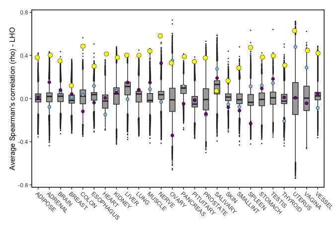<!-- -->

``` r
corr_mean = rowMeans(as.matrix(df))
names(corr_mean) = rownames(df)
corr_mean = corr_mean[order(corr_mean)]
corr_mean = corr_mean[which(!is.na(corr_mean))]

# Prepare the data
corr_mean_df <- data.frame(
    Gene = names(corr_mean),
    Value = corr_mean,
    AbsValue = abs(corr_mean),
    Sign = ifelse(corr_mean < 0, "negative", "positive")
)

# Create a sequence for the x-axis
corr_mean_df$Index <- seq(1, nrow(corr_mean_df))

# Highlight specific genes with custom colors and settings
highlight_data <- corr_mean_df %>% 
    filter(Gene %in% c("ENSG00000131080", "ENSG00000135960", "ENSG00000158813")) %>%
    mutate(
        fill = case_when(
            Gene == "ENSG00000131080" ~ "yellow",
            Gene == "ENSG00000135960" ~ "magenta",
            Gene == "ENSG00000158813" ~ "lightblue"
        ),
        color = case_when(
            Gene == "ENSG00000131080" ~ "black",
            Gene == "ENSG00000135960" ~ "white",
            Gene == "ENSG00000158813" ~ "white"
        )
    )

# Create the plot
p_corr_mean <- ggplot(corr_mean_df, aes(x = Index, y = AbsValue)) +
    geom_point(aes(
        color = Sign,
        fill = Sign,
        shape = Sign
    ), size = 3) +
    scale_color_manual(values = c("negative" = "lightblue", "positive" = "lightcoral")) +
    scale_fill_manual(values = c("negative" = "darkblue", "positive" = "darkred")) +
    scale_shape_manual(values = c("negative" = 21, "positive" = 21)) +
    geom_point(data = highlight_data,
               aes(x = Index, y = AbsValue),
               shape = 21, size = 4, stroke = 1,
               fill = highlight_data$fill, color = highlight_data$color) +
    theme_bw() +
    theme(
        axis.text.x = element_blank(),
        axis.ticks.x = element_blank(),
        plot.title = element_text(color = "black", size = 14, face = "bold", hjust = 0.5),
        panel.grid.major = element_blank(),
        panel.grid.minor = element_blank(),
        panel.background = element_rect(colour = "black", size = 1),
        aspect.ratio = 1.5  # Adjust the ratio; higher values compress the x-axis
    ) +
    labs(
        title = "Absolute Values of corr_mean",
        x = "Gene Index",
        y = "Absolute Value of mean Pearson's correlation coefficient"
    )
p_corr_mean
```

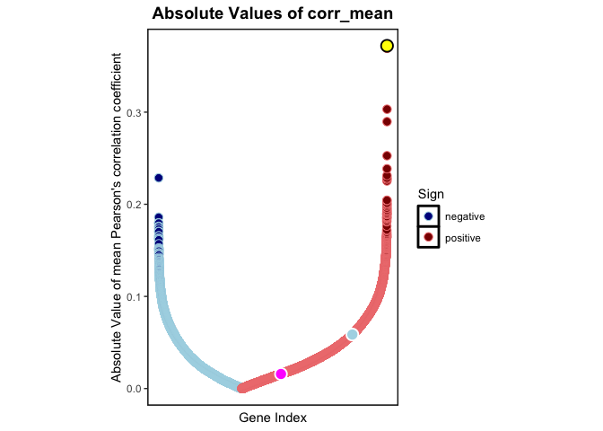<!-- -->

### Animal models

Here we extened correlations analysis to animal models (mouse, rat)
using data and annotations from the ***Tabula Muris Senis*** and ***Rat
BodyMap*** projects. Comprehensive analyses for all tissue types are
included as all data is publiclcy available.

##### Correlation analysis of gene expression and age - *Tabula Muris Senis*

``` r
# Import raw count matrix and discard samples with < 2M reads mapped to genes
mus.rawcounts <- read.table(file = "./data/mouse/mus_rawcounts.txt", header = TRUE, row.names = 1)
samples2keep <- colnames(mus.rawcounts)[colSums(mus.rawcounts) > 2e6]
mus.rawcounts <- mus.rawcounts[, samples2keep]

# Fetch gene annotations
mus_gene_annot <- data.frame(
  SYMBOL = mapIds(org.Mm.eg.db, keys = rownames(mus.rawcounts), column = "SYMBOL", keytype = "ENSEMBL"),
  ENTREZ = mapIds(org.Mm.eg.db, keys = rownames(mus.rawcounts), column = "ENTREZID", keytype = "ENSEMBL"),
  ENSEMBL = rownames(mus.rawcounts),
  CHR = mapIds(org.Mm.eg.db, keys = rownames(mus.rawcounts), column = "CHR", keytype = "ENSEMBL"),
  row.names = rownames(mus.rawcounts)
)

# Load and prepare sample annotation file
mus.annot <- read.csv(file = "./data/mouse/GSE132040_MACA_Bulk_metadata.csv", header = TRUE, row.names = 1)

# Set the row names of mus.annot to match the `raw.file` column
rownames(mus.annot) <- mus.annot$raw.file

# Filter mus.annot to keep only the samples that match those in mus.rawcounts
mus.annot <- mus.annot[samples2keep, ]

# Update annotations
mus.annot <- mus.annot %>%
  mutate(
    AGE = characteristics..age,
    SEX = characteristics..sex,
    SOURCE = ifelse(grepl("BAT|SCAT|GAT|MAT", source.name), "Adipose", source.name)
  )

# Ensure that the column names of mus.rawcounts match the row names of mus.annot
mus.rawcounts <- mus.rawcounts[, rownames(mus.annot)]

# Create DESeqDataSet
mus.dds <- DESeqDataSetFromMatrix(countData = mus.rawcounts, colData = mus.annot, design = ~ 1)

# Normalize read counts
mus.vst <- vst(mus.dds, blind = TRUE)

# Available murine tissues
tissues <- c("Liver", "Adipose", "Brain", "Lung", "Limb", "WBC", "Small", "Spleen", "Pancreas", "Heart", "Skin", "Marrow", "Bone", "Kidney")

# Function to compute correlations for a given tissue
compute_correlations <- function(tissue) {
  currentSamples <- rownames(mus.annot[grep(tissue, mus.annot$SOURCE), ])
  currentAnnot <- mus.annot[currentSamples, ]
  current.vst <- mus.vst[, currentSamples]
  
  # Batch effect correction (SEX), while preserving AGE-associated differences
  batchcov <- model.matrix(~ 0 + AGE, data = currentAnnot)
  assay(current.vst) <- removeBatchEffect(assay(current.vst), batch = currentAnnot$SEX, design = batchcov)
  
  # Aggregate by timepoint and compute Pearson's correlation with log2(months)
  ages <- unique(currentAnnot$AGE)
  currGE_median <- sapply(ages, function(age) {
    rowMedians(assay(current.vst)[, currentAnnot$AGE == age], na.rm = TRUE)
  })
  rownames(currGE_median) <- rownames(assay(current.vst))
  
  #months <- log2(c(1, 3, 6, 9, 12, 15, 18, 21, 24, 27))
  months <- log2(as.integer(colnames(currGE_median)))
  corrtest <- apply(currGE_median, 1, cor.test, months, method = "pearson")
  data.frame(
    pvalue = sapply(corrtest, function(x) x$p.value),
    coef = sapply(corrtest, function(x) x$estimate)
  )
}

# Compute correlations for each tissue
mus_correlations <- lapply(tissues, compute_correlations)
names(mus_correlations) <- tissues

# Extracting correlation coefficients
mus_coefs <- do.call(cbind, lapply(mus_correlations, function(x) x$coef))
colnames(mus_coefs) <- tissues
rownames(mus_coefs) <- rownames(mus_correlations[[1]])

# Ranking genes for their median correlation coefficient across tissues
mus_metacoefs <- rowMedians(mus_coefs, na.rm = TRUE)
mus_metacorr <- data.frame(
  metaCoefs = mus_metacoefs,
  mus_gene_annot[rownames(mus_coefs), ]
) %>%
  arrange(desc(metaCoefs))

mus_metaTable <- data.frame(
  ENSEMBL = mus_metacorr$ENSEMBL,
  SYMBOL = mus_metacorr$SYMBOL,
  ENTREZ = mus_metacorr$ENTREZ,
  CHR = mus_metacorr$CHR,
  medianCorr = mus_metacorr$metaCoefs,
  row.names = NULL
)

# Display the top 10 genes
head(mus_metaTable, n = 10)
```

    ##               ENSEMBL   SYMBOL ENTREZ CHR medianCorr
    ## 1  ENSMUSG00000067149   Jchain  16069   5  0.9232931
    ## 2  ENSMUSG00000076612   Ighg2c 404711  12  0.9125484
    ## 3  ENSMUSG00000076609     Igkc  16071   6  0.8839580
    ## 4  ENSMUSG00000076613   Ighg2b  16016  12  0.8684794
    ## 5  ENSMUSG00000093894 Ighv1-53 780931  12  0.8482030
    ## 6  ENSMUSG00000073418      C4b  12268  17  0.8430811
    ## 7  ENSMUSG00000060586   H2-Eb1  14969  17  0.8274894
    ## 8  ENSMUSG00000029816    Gpnmb  93695   6  0.8110657
    ## 9  ENSMUSG00000036594    H2-Aa  14960  17  0.8086181
    ## 10 ENSMUSG00000076617     Ighm  16019  12  0.8063952

<br>

##### Correlation analysis of gene expression and age - Rat Bodymap Project (GSE53960)

``` r
# Import raw count matrix and discard samples with < 2M reads mapped to genes
rat.rawcounts <- read.table(file = "./data/rat/rat_rawcounts.txt", header = TRUE, row.names = 1)
samples2keep <- colnames(rat.rawcounts)[colSums(rat.rawcounts) > 2e6]
rat.rawcounts <- rat.rawcounts[, samples2keep]

# Fetch gene annotations
rat_gene_annot <- data.frame(
  SYMBOL = mapIds(org.Rn.eg.db, keys = rownames(rat.rawcounts), column = "SYMBOL", keytype = "ENSEMBL"),
  ENTREZ = mapIds(org.Rn.eg.db, keys = rownames(rat.rawcounts), column = "ENTREZID", keytype = "ENSEMBL"),
  ENSEMBL = rownames(rat.rawcounts),
  CHR = mapIds(org.Rn.eg.db, keys = rownames(rat.rawcounts), column = "CHR", keytype = "ENSEMBL"),
  row.names = rownames(rat.rawcounts)
)

# Load and prepare sample annotation file
rat.annot <- read.table(file = "./data/rat/rat_annot.txt", sep = "\t", header = TRUE, row.names = 1)

# Ensure that the column names of rat.rawcounts match the row names of rat.annot
rat.rawcounts <- rat.rawcounts[, rownames(rat.annot)]

# Create DESeqDataSet
rat.dds <- DESeqDataSetFromMatrix(countData = rat.rawcounts, colData = rat.annot, design = ~ 1)

# Normalize read counts
rat.vst <- vst(rat.dds, blind = TRUE)

# Define tissues to analyze
tissues <- c("adrenal", "brain", "heart", "kidney", "liver", "lung", "muscle", "spleen", "thymus", "testes", "uterus")

# Function to compute correlations for a given tissue
compute_correlations <- function(tissue) {
  currentSamples <- rownames(rat.annot[grep(tissue, rat.annot$TISSUE), ])
  currentAnnot <- rat.annot[currentSamples, ]
  current.vst <- rat.vst[, currentSamples]
  
  if (length(unique(currentAnnot$SEX)) > 1) {
    batchcov <- model.matrix(~ 0 + AGE, data = currentAnnot)
    assay(current.vst) <- removeBatchEffect(assay(current.vst), batch = currentAnnot$SEX, design = batchcov)
  }
  
  ratGE <- assay(current.vst)
  months <- setNames(currentAnnot$AGE, rownames(currentAnnot))
  
  corrtest <- apply(ratGE, 1, cor.test, log2(months), method = "pearson")
  
  data.frame(
    pvalue = sapply(corrtest, function(x) x$p.value),
    coef = sapply(corrtest, function(x) x$estimate),
    row.names = rownames(ratGE)
  )
}

# Compute correlations for each tissue
rat_correlations <- lapply(tissues, compute_correlations)
names(rat_correlations) <- tissues

# Extracting correlation coefficients
rat_coefs <- do.call(cbind, lapply(rat_correlations, `[[`, "coef"))
dimnames(rat_coefs) = list(rownames(rat_correlations[[1]]), tissues)

# Ranking genes for their median correlation coefficient across tissues
rat_metacoefs <- rowMedians(rat_coefs, na.rm = TRUE)
rat_metacorr <- data.frame(
  metaCoefs = rat_metacoefs,
  rat_gene_annot[rownames(rat_coefs), ]
) %>%
  arrange(desc(metaCoefs))

rat_metaTable <- data.frame(
  ENSEMBL = rat_metacorr$ENSEMBL,
  SYMBOL = rat_metacorr$SYMBOL,
  ENTREZ = rat_metacorr$ENTREZ,
  CHR = rat_metacorr$CHR,
  medianCorr = rat_metacorr$metaCoefs,
  row.names = NULL
)

# Display the top 10 genes
head(rat_metaTable, n = 10)
```

    ##               ENSEMBL   SYMBOL ENTREZ  CHR medianCorr
    ## 1  ENSRNOG00000031090     <NA>   <NA> <NA>  0.9077415
    ## 2  ENSRNOG00000014691     Ric3 687147    1  0.9045887
    ## 3  ENSRNOG00000054990     <NA>   <NA> <NA>  0.8987979
    ## 4  ENSRNOG00000038999 RT1-CE11 414791   20  0.8920466
    ## 5  ENSRNOG00000015253     Hsf4 291960   19  0.8903713
    ## 6  ENSRNOG00000047706  RT1-CE2 414779   20  0.8844498
    ## 7  ENSRNOG00000015588     Nol3  85383   19  0.8839475
    ## 8  ENSRNOG00000050210     <NA>   <NA> <NA>  0.8804940
    ## 9  ENSRNOG00000039744     <NA>   <NA> <NA>  0.8768571
    ## 10 ENSRNOG00000059625     <NA>   <NA> <NA>  0.8737349

##### Depict correlations - Tabula Muris Senis + Rat Bodymap Project (GSE53960)

``` r
# Combine the mouse and rat data into a single dataframe
df <- rbind(
  data.frame(SYMBOL = mus_metaTable$SYMBOL, Median_Corr = mus_metaTable$medianCorr, SPECIES = "MOUSE"),
  data.frame(SYMBOL = rat_metaTable$SYMBOL, Median_Corr = rat_metaTable$medianCorr, SPECIES = "RAT")
)

# Filter for the Eda2r gene
df.eda2r <- df[df$SYMBOL == "Eda2r", ]

# Plot
p_gene <- ggplot(df, aes(x = SPECIES, y = Median_Corr, fill = SPECIES)) +
  geom_half_boxplot(side = "l", alpha = 0.4, show.legend = FALSE, outlier.alpha = 0) +  # Hide legend for boxplot
  geom_half_violin(side = "r", trim = TRUE, alpha = 0.4, show.legend = FALSE) +         # Hide legend for violin
  geom_point(data = df.eda2r, aes(x = SPECIES, y = Median_Corr, fill = "Eda2r"), 
             color = "black", shape = 21, stroke = 1, size = 8, show.legend = TRUE) +
  scale_fill_manual(values = c("MOUSE" = "white", "RAT" = "lightgrey", "Eda2r" = "yellow"),
                    breaks = "Eda2r", labels = "Eda2r") +  # Only show "Eda2r" in the legend
  coord_fixed(ratio = 2) +  # Adjust the ratio to compress the x-axis
  theme_bw() + 
  theme(
    axis.title.x = element_blank(),  # Remove the x-axis title
    axis.text.x = element_text(angle = 0, vjust = 0.5),  # Keep the x-axis labels for MOUSE and RAT
    axis.ticks.x = element_line(),                      # Keep x-axis ticks
    legend.position = "right",                          # Position the legend on the right
    legend.title = element_blank(),                     # Remove the title of the legend
    legend.text = element_text(size = 8)                # Make the legend text smaller
  )  +
  labs( 
    x = "",
    y = "Median Pearson's correlation coefficient (r)"
  ) +
  guides(fill = guide_legend(override.aes = list(shape = 21, size = 6, color = "black", stroke = 1)))

p_gene
```

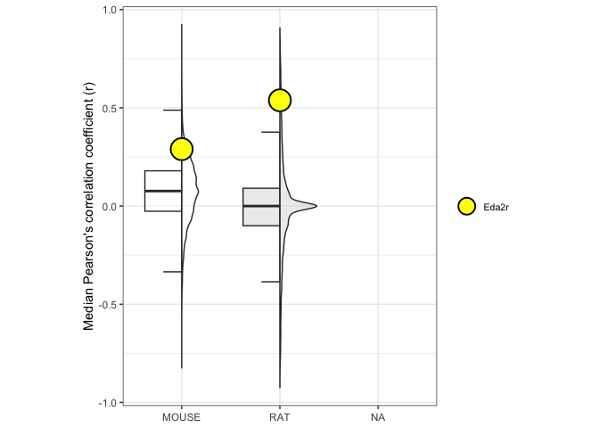<!-- -->

<br>

#### Murine Model of HGPS (GSE165409)

Here we extened correlations analysis to animal models (mouse, rat)
using data and annotations from the ***Tabula Muris Senis*** and ***Rat
BodyMap*** projects. Comprehensive analyses for all tissue types are
included as all data is publiclcy available.

##### Data Processing and normalization

``` r
# Load raw counts and annotations
hgps_rawcounts <- read.table("./data/progeria/GSE165409_LMNA_rawCounts_18samp.txt", header = TRUE, row.names = 1, sep = "\t")
hgps_annot <- data.frame(row.names = colnames(hgps_rawcounts), GROUP = rep(c("LMNA_Y", "WT_Y", "WT_O"), each = 6), OUTLIER = c(rep("NO", 12), rep("YES", 6)))

# Align raw counts with annotations
hgps_rawcounts <- hgps_rawcounts[, rownames(hgps_annot)]

# Retrieve gene annotations
symbols <- mapIds(org.Mm.eg.db, keys = rownames(hgps_rawcounts), column = "SYMBOL", keytype = "ENSEMBL", multiVals = "first")
entrez <- mapIds(org.Mm.eg.db, keys = rownames(hgps_rawcounts), column = "ENTREZID", keytype = "ENSEMBL", multiVals = "first")
hgps_gene_annot <- data.frame(SYMBOL = symbols, ENTREZ = entrez, row.names = rownames(hgps_rawcounts))

# Create DESeq2 Object
hgps_dds <- DESeqDataSetFromMatrix(countData = hgps_rawcounts, colData = hgps_annot, design = ~ GROUP)

# Normalize and transform counts
hgps_dds.vst <- vst(hgps_dds, blind = TRUE)
hgps_dds.assay <- assay(hgps_dds.vst)

# PCA Analysis
ntop <- 2000
selected <- order(rowVars(hgps_dds.assay), decreasing = TRUE)[1:ntop]
pca <- prcomp(t(hgps_dds.assay[selected, ]))
percentVar <- round(100 * (pca$sdev^2 / sum(pca$sdev^2)))

df.pca <- data.frame(PC1 = pca$x[, 1], PC2 = pca$x[, 2], GROUP = hgps_annot$GROUP, LABEL = rownames(pca$x))

# Plotting
p1 <- ggplot(df.pca, aes(x = PC1, y = PC2, color = GROUP)) +
  geom_point(size = 3.5, aes(fill = GROUP), color = "black", pch = 21, stroke = 0.8) +
  coord_fixed(ratio = 6 / 5) +
  xlab(paste0("PC1 : ", percentVar[1], " % variance")) +
  ylab(paste0("PC2 : ", percentVar[2], " % variance")) +
  geom_text_repel(aes(label = LABEL), nudge_y = 5, nudge_x = 5, segment.size = 0.4, hjust = 1, point.padding = 0.5,
                  arrow = arrow(length = unit(0.08, "inches"), angle = 15, type = "closed", ends = "first")) +
  theme_bw() +
  theme(
    panel.grid = element_blank(),
    panel.background = element_rect(fill = NA, colour = "black", size = 1),
    axis.text = element_text(size = 10, face = "plain"),
    axis.title = element_text(size = 12, face = "plain", family = "Arial"),
    axis.ticks.x = element_line(colour = "black")
  )

p1
```

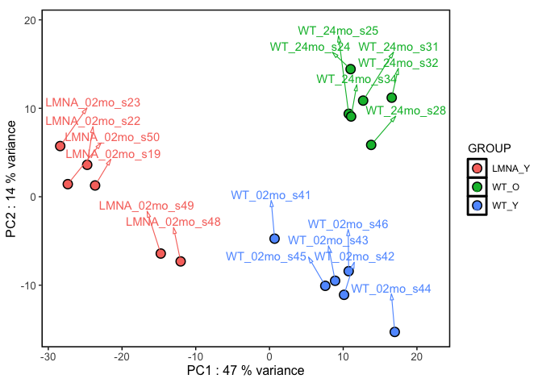<!-- -->

<br>

##### Differential expression analysis

``` r
# Run DESeq2 ----------------------------------
hgps_dds  <- estimateSizeFactors(hgps_dds)
hgps_dds <- DESeq(hgps_dds)

# Discard genes without gene symbol -----------
hgps_dds.subset <- hgps_dds[!is.na(hgps_gene_annot$SYMBOL),]

# Define Contrasts ------------------------------
contrast_list <- list(
  "LMNA_Y_vs_WT_Y" = c("GROUP", "LMNA_Y", "WT_Y"),
  "WT_O_vs_WT_Y" = c("GROUP", "WT_O", "WT_Y"),
  "LMNA_Y_vs_WT_O" = c("GROUP", "LMNA_Y", "WT_O")
)

# Perform Differential Expression Analysis ------------------------------
de_results <- lapply(contrast_list, function(contrast) {
  res <- results(hgps_dds.subset, contrast = contrast, alpha = 0.1)
  res <- res[order(res$pvalue), ]
  res <- as.data.frame(res)
  res$SYMBOL <- hgps_gene_annot[rownames(res),]$SYMBOL
  return(res)
})

# Extract the specific comparison (LMNA_Y vs WT_Y)
res <- de_results[["LMNA_Y_vs_WT_Y"]]
res <- res[res$baseMean > 100, ]

# Volcano Plot Preparation ------------------------------
threshold_FC <- 1
threshold_PVALUE <- 0.05

# Define colors and sizes
res$FDR <- -10 * log10(res$padj)  # Adjust the y-axis scale to -10*log10(FDR)
res$color <- ifelse(res$SYMBOL == "Eda2r", "yellow",
                    ifelse(res$log2FoldChange > threshold_FC & res$padj < threshold_PVALUE, "darkred",
                           ifelse(res$log2FoldChange < -threshold_FC & res$padj < threshold_PVALUE, "darkblue", "grey60")))
res$border <- ifelse(res$SYMBOL == "Eda2r", "black",
                     ifelse(res$color == "darkred", "lightcoral",
                            ifelse(res$color == "darkblue", "lightblue", "grey")))
res$size <- ifelse(res$SYMBOL == "Eda2r", 6,  # Further increased size for "Eda2r"
                   ifelse(res$color == "grey60", 1.2, 1.5))

# Create the volcano plot
p <- ggplot(res, aes(x = log2FoldChange, y = FDR, color = border, fill = color, size = size)) +
  geom_point(shape = 21) +
  scale_color_identity() +
  scale_fill_identity() +
  scale_size_identity() +
  theme_bw() +
  geom_vline(xintercept = c(-threshold_FC, threshold_FC), col = "brown") +
  geom_hline(yintercept = -10 * log10(threshold_PVALUE), col = "brown") +
  labs(title = "Volcano Plot", x = "log2(Fold-Change)", y = "-10 * log10(FDR)") +
  xlim(-2.75, 4) +  # Set x-axis range
  geom_text_repel(data = res[res$SYMBOL == "Eda2r", ], aes(label = SYMBOL), 
                  size = 5, nudge_y = 2, nudge_x = 1, color = "black") +  # Shift label further to the right
  theme(
    plot.title = element_text(hjust = 0.5, size = 14),
    axis.text = element_text(size = 10),
    axis.title = element_text(size = 12)
  )

print(p)
```

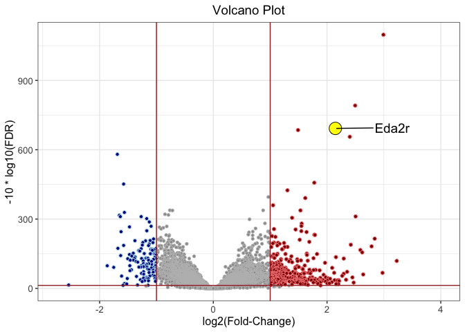<!-- -->

<br>

``` r
# Extract CPM values for Eda2r (ENSMUSG00000034457) in the first 12 samples (6 HGPS and 6 WT)
hgps_dds.cpm <- cpm(hgps_dds, normalized.lib.sizes = TRUE)
eda2r_cpm <- hgps_dds.cpm["ENSMUSG00000034457", 1:12]

# Create a data frame for plotting
cpmbplot <- data.frame(
  GROUP = factor(rep(c("HGPS", "WT"), each = 6), levels = c("WT", "HGPS")),
  EXP = as.numeric(eda2r_cpm)
)

# Generate the violin plot
p_gene <- ggplot(cpmbplot, aes(x = GROUP, y = EXP, fill = GROUP)) +
  geom_violin(width = 0.4, trim = FALSE) +
  geom_jitter(shape = 21, size = 2, position = position_jitter(width = 0.1), color = "black") +
  coord_fixed(ratio = 0.1) +
  theme_bw() +
  theme(axis.text.x = element_text(angle = 0, vjust = 0.5))
p_gene
```

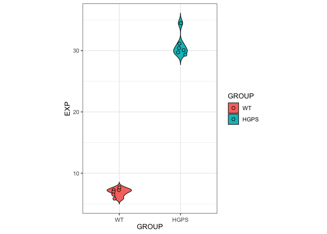<!-- -->

##### HGPS - Murine keratinocytes (GSE67289)

``` r
# Load series and platform data from GEO
gset <- getGEO("GSE67289", GSEMatrix = TRUE, AnnotGPL = FALSE)
if (length(gset) > 1) gset <- gset[[grep("GPL6193", attr(gset, "names"))]] else gset <- gset[[1]]

# Prepare the expression matrix and sample groups
gsms <- "XXXXXXXXXXXXXXXXXXXXXXXXXXXXXXXXXXXXXXXXXXXXXXXXXXXXXXXXXXXXXXXXX1111000011110000"
sml <- strsplit(gsms, split = "")[[1]]
sel <- which(sml != "X")
gset <- gset[, sel]
gs <- factor(sml[sel], labels = c("WT", "HGPS"))
gset$group <- gs
gset$TP <- rep(c("T24", "T32"), each = 8)

# Adjust for batch effect
ex <- exprs(gset)
batchcov <- model.matrix(~ 0 + group, data = gset)
gs_expr_adj <- removeBatchEffect(ex, batch = gset$TP, design = batchcov)

# Differential expression analysis with limma
design <- model.matrix(~ 0 + group + TP, gset)
colnames(design) <- c("WT", "HGPS", "TP")
fit <- lmFit(gset, design)
HGPSvsWT <- makeContrasts(HGPS - WT, levels = design)
fit2 <- eBayes(contrasts.fit(fit, HGPSvsWT))
tT <- topTable(fit2, adjust = "fdr", sort.by = "B", number = Inf)

# Extract all the Eda2r probes from DE-results
eda2r_probes <- rownames(tT[grep("Eda2r", tT$gene_assignment), ])

# Summarize expression levels
gs_annot <- data.frame(
  GROUP = factor(rep(c("HGPS", "WT"), each = 4, times = 2), levels = c("WT", "HGPS")),
  TP = rep(c("T24", "T32"), each = 8),
  Eda2r_adj = colMedians(gs_expr_adj[eda2r_probes, ])
)

# Create the box plot
my_comparisons <- list(c("HGPS", "WT"))
p1 <- ggplot(gs_annot, aes(y = Eda2r_adj, x = GROUP, fill = GROUP)) +
  geom_half_violin(trim = FALSE, scale = "width", draw_quantiles = FALSE, side = "r") +
  geom_boxplot(fill = "white") +
  geom_point(size = 3.5, color = "black", fill = "white", pch = 21, stroke = 0.5) +  # Black dots with white border
  stat_compare_means(comparisons = my_comparisons, color = "black", bracket.size = 0.5) +
  coord_fixed(ratio = 2) + 
  theme_bw() +
  scale_fill_manual(values = c("WT" = "green4", "HGPS" = "violetred")) +  # Violin colors as in the figure
  scale_x_discrete(labels = c("WT", "LMNA-G609G")) +  # Custom labels for the x-axis
  theme(
    panel.grid = element_blank(),
    panel.background = element_rect(fill = NA, color = "black", size = 1),
    axis.text = element_text(size = 10, face = "plain"),
    axis.title = element_text(size = 12, face = "plain", family = "Arial"),
    axis.ticks.x = element_line(color = "black")
  )

p1
```

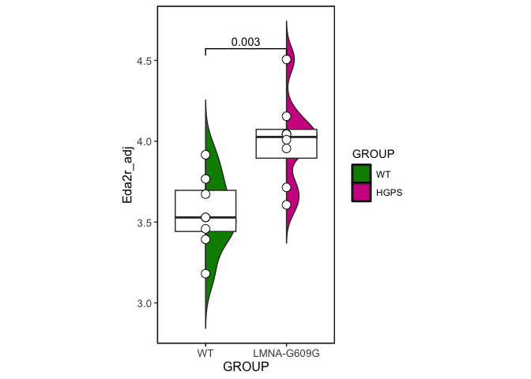<!-- -->

##### HGPS - murine Adipocytes (GSE51203)

``` r
# Load series and platform data from GEO
gset <- getGEO("GSE51203", GSEMatrix = TRUE, AnnotGPL = TRUE)
if (length(gset) > 1) gset <- gset[[grep("GPL6096", attr(gset, "names"))]] else gset <- gset[[1]]

# Prepare the expression matrix and sample groups
gsms <- "000111222"
sml <- strsplit(gsms, split = "")[[1]]
gs <- factor(sml, levels = c("0", "2", "1"), labels = c("WT", "LCS", "G609G"))  # Reorder and relabel the groups
gset$group <- gs

# Log2 transformation if necessary
ex <- exprs(gset)
qx <- as.numeric(quantile(ex, c(0., 0.25, 0.5, 0.75, 0.99, 1.0), na.rm = TRUE))
if ((qx[5] > 100) || (qx[6] - qx[1] > 50 && qx[2] > 0)) {
  ex[which(ex <= 0)] <- NaN
  exprs(gset) <- log2(ex)
}

# Differential expression analysis with limma
design <- model.matrix(~ 0 + group, data = gset)
colnames(design) <- levels(gs)
fit <- lmFit(gset, design)
cts <- c("G609G-WT", "LCS-WT", "G609G-LCS")
cont.matrix <- makeContrasts(contrasts = cts, levels = design)
fit2 <- contrasts.fit(fit, cont.matrix)
fit2 <- eBayes(fit2)
tT <- topTable(fit2, adjust = "fdr", sort.by = "B", number = Inf)

# Extract all the Eda2r probes from DE-results
eda2r_probes <- rownames(tT[grep("Eda2r", tT$gene_assignment), ])

# Summarize expression levels
gs_annot <- data.frame(
  GROUP = gs,
  Eda2r = colMedians(exprs(gset)[eda2r_probes, ])
)

# Combine WT and LCS into one group for the Wilcoxon test
gs_annot$Combined_Group <- factor(ifelse(gs_annot$GROUP %in% c("WT", "LCS"), "Non_G609G", "G609G"))

# Perform Wilcoxon test between the combined group (WT + LCS) and G609G
wilcox_test <- wilcox.test(gs_annot$Eda2r ~ gs_annot$Combined_Group)
wilcox_pvalue <- signif(wilcox_test$p.value, digits = 3)

# Create the box plot with the original 3 groups
p1 <- ggplot(gs_annot, aes(y = Eda2r, x = GROUP, fill = GROUP)) +
  geom_half_violin(trim = TRUE, scale = "width", draw_quantiles = FALSE, side = "r") +
  geom_boxplot(fill = "white") +
  geom_point(size = 3.5, fill = "black", color = "white", pch = 21, stroke = 0.5) +  # Black dots with white border
  coord_fixed(ratio = 2) + 
  theme_bw() +
  scale_fill_manual(values = c("WT" = "green4", "LCS" = "lightgreen", "G609G" = "violetred")) +  # Adjust colors
  scale_x_discrete(labels = c("WT", "LCS", "G609G")) +  # Custom labels for the x-axis
  theme(
    panel.grid = element_blank(),
    panel.background = element_rect(fill = NA, color = "black", size = 1),
    axis.text = element_text(size = 10, face = "plain"),
    axis.title = element_text(size = 12, face = "plain", family = "Arial"),
    axis.ticks.x = element_line(color = "black")
  )

# Add the Wilcoxon p-value as a label
p1 <- p1 + annotate("text", x = 2, y = max(gs_annot$Eda2r) + 0.5, 
                    label = paste("p =", wilcox_pvalue), 
                    size = 5, hjust = 0.5)

p1
```

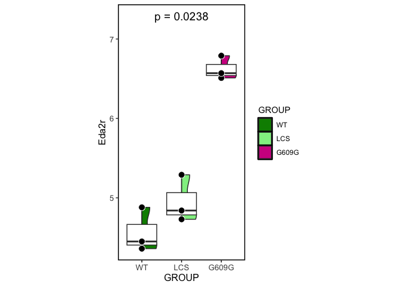<!-- -->

#### Age-associated transcriptional modifications in Skeletal muscle muscle

Here we extened correlations analysis to humans (muscle biopsy study -
FUSION) and other animal models (mouse, rat) using data and annotations
from the ***Tabula Muris Senis*** and ***Rat BodyMap*** projects.
Comprehensive analyses for all tissue types are included as all data is
publiclcy available.

##### Homo Sapiens (phs001048) - vastus lateralis

``` r
# Load table
vastus = read.table("data/human/phs001048.txt", header = T, sep = "\t")

# Rename the columns for easier access
colnames(vastus) <- c("Dataset", "Subject_ID", "EDA2R_expression", "Age", "AGE_GROUP", "Sex", "BMI", "Smoking_status")

# Set the age groups order for plotting
vastus$AGE_GROUP <- factor(vastus$AGE_GROUP, levels = c("20-40", "41-50", "51-60", "61-80"))

# Define comparisons for stat_compare_means
my_comparisons <- list(c("20-40", "41-50"), c("41-50", "51-60"), c("51-60", "61-80"), c("20-40", "61-80"))

# Define a color gradient for the groups
color_gradient <- c("20-40" = "pink", "41-50" = "lightcoral", "51-60" = "red", "61-80" = "darkred")

# Compute p-values for each pair of groups
p_values <- map_dbl(my_comparisons, function(groups) {
  group1 <- vastus %>% filter(AGE_GROUP == groups[1]) %>% pull(EDA2R_expression)
  group2 <- vastus %>% filter(AGE_GROUP == groups[2]) %>% pull(EDA2R_expression)
  wilcox.test(group1, group2)$p.value
})

# Adjust p-values for multiple comparisons using FDR
adjusted_p_values <- p.adjust(p_values, method = "fdr")

# Create the plot
p_vastus <- ggplot(vastus, aes(x = AGE_GROUP, y = EDA2R_expression, fill = AGE_GROUP)) +
  geom_half_violin(trim = FALSE, scale = "width", draw_quantiles = FALSE, side = "r", width = 0.5) +
  geom_half_boxplot(side = "l", width = 0.5, color = "black", outlier.shape = NA) +  # Exclude outliers
  geom_half_point(position = position_jitter(width = 0.1), size = 0.5, color = "black", fill = "black", shape = 21) +  # Points on the right side
  theme_bw() +
  labs(y = expression(italic("EDA2R") * " expression [TPM]"), x = NULL) +
  scale_x_discrete(labels = c("20-40\nyrs", "41-50\nyrs", "51-60\nyrs", "61-80\nyrs")) +  # Custom x-axis labels
  scale_fill_manual(values = color_gradient) +  # Color gradient for the groups
  theme(
    panel.grid = element_blank(),
    panel.background = element_rect(fill = NA, color = "black", size = 1),
    axis.text = element_text(size = 10, face = "plain"),
    axis.title.y = element_text(size = 12, face = "plain", family = "Arial", hjust = 0.5),
    axis.ticks.x = element_line(color = "black"),
    axis.text.x = element_text(size = 12, face = "plain", family = "Arial", hjust = 0.5),
    legend.position = "none"
  ) +
  coord_fixed(ratio = 1.5)  # Compress the x-axis

# Display the plot
p_vastus
```

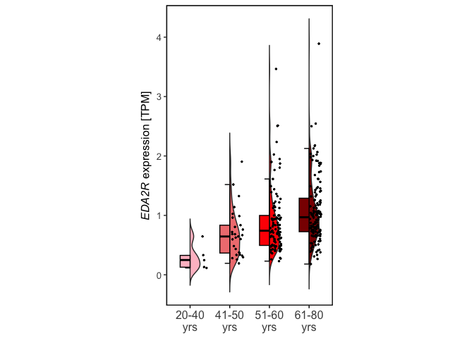<!-- -->

##### Mus Musculus (GSE52550)

``` r
# load series and platform data from GEO
gset <- getGEO("GSE52550", GSEMatrix =TRUE, AnnotGPL=TRUE)
if (length(gset) > 1) idx <- grep("GPL1261", attr(gset, "names")) else idx <- 1
gset <- gset[[idx]]

# make proper column names to match toptable 
fvarLabels(gset) <- make.names(fvarLabels(gset))

# group membership for all samples
gsms <- "111XXX000XXX"
sml <- strsplit(gsms, split="")[[1]]

# filter out excluded samples (marked as "X")
sel <- which(sml != "X")
sml <- sml[sel]
gset <- gset[ ,sel]

# log2 transformation
ex <- exprs(gset)
qx <- as.numeric(quantile(ex, c(0., 0.25, 0.5, 0.75, 0.99, 1.0), na.rm=T))
LogC <- (qx[5] > 100) ||
          (qx[6]-qx[1] > 50 && qx[2] > 0)
if (LogC) { ex[which(ex <= 0)] <- NaN
  exprs(gset) <- log2(ex) }

# assign samples to groups and set up design matrix
gs <- factor(sml)
groups <- make.names(c("OLD","YOUNG"))
levels(gs) <- groups
gset$group <- gs
design <- model.matrix(~group + 0, gset)
colnames(design) <- levels(gs)

# Fit linear model and calculate statistics
fit <- lmFit(gset, design)
cts <- makeContrasts(OLD - YOUNG, levels = design)
fit2 <- contrasts.fit(fit, cts)
fit2 <- eBayes(fit2, 0.01)
tT <- topTable(fit2, adjust = "fdr", sort.by = "B", number = Inf)
tT <- subset(tT, select = c("adj.P.Val", "P.Value", "t", "B", "logFC", "Gene.symbol"))

# Prepare data for plotting
tT$rklogSIG <- -10 * log10(tT$adj.P.Val) * sign(tT$logFC)
tT <- tT[order(tT$rklogSIG, decreasing = TRUE), ]
tT$posrank <- seq_len(nrow(tT))
tT$GROUP <- "OLD.vs.YNG"

# Eda2r specific data
eda2r_data <- tT[rownames(tT) == "1440085_at", ]
logFC_label <- paste0("log2FC = ", round(eda2r_data$logFC, 2))
rank_label <- paste0("Rank: ", eda2r_data$posrank, "/", nrow(tT))

# Create the plot
p_gene <- ggplot(tT, aes(x = GROUP, y = rklogSIG)) +
  geom_violin(width = 0.4, trim = FALSE, fill = "grey80", color = "black") +
  geom_boxplot(width = 0.08, outlier.size = 1, fill = "white", color = "black") +
  geom_point(data = eda2r_data, fill = "yellow", color = "black", shape = 21, stroke = 1, size = 8) +
  geom_text_repel(data = eda2r_data, aes(x = GROUP, y = rklogSIG), label = paste0("Eda2r\n1440085_at\n",logFC_label,"\n",rank_label), nudge_x = 1, nudge_y = 6, size = 5, fontface = "italic") +
  # geom_text(aes(x = 1, y = 29), label = paste(logFC_label, rank_label, fdr_label, sep = "\n"), size = 5, hjust = 0, vjust = 1) +
  labs(y = expression(Significance ~ "[-10 x log"[10] ~ "FDR]"), x = NULL) +
  theme_bw() +
  coord_fixed(ratio = 0.02) + # Compress the x-axis
  theme(
    axis.text.x = element_text(size = 12, face = "bold"),
    axis.title.y = element_text(size = 14, face = "bold"),
    panel.grid = element_blank(),
    panel.border = element_rect(color = "black", fill = NA, size = 1),
    axis.ticks.x = element_blank(),
    legend.position = "none"
  ) +
  geom_hline(yintercept = 10 * log10(0.05), linetype = "dashed", color = "blue") +
  geom_hline(yintercept = -10 * log10(0.05), linetype = "dashed", color = "red")

# Display the plot
p_gene
```

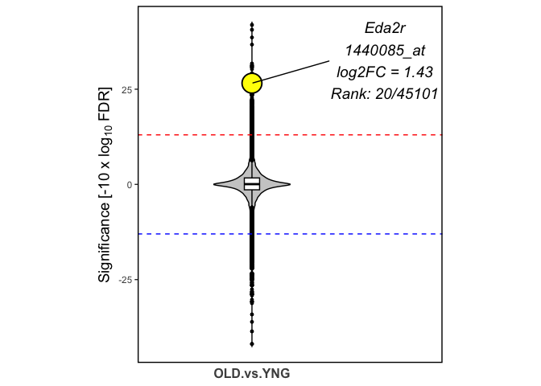<!-- -->

``` r
# Load data and prepare the expression set
mus_gm_annot = read.table("./data/mouse/GSE52550_RAW/GSE52550_annotations.txt", sep = "\t", stringsAsFactors = F, header = T, row.names = 1)
mus_gm_annot = mus_gm_annot[which(mus_gm_annot$Genotype=="WT"),]
targets <- rownames(mus_gm_annot)

ab <- ReadAffy(filenames = targets, celfile.path = "./data/mouse/GSE52550_RAW/")
mus_gm_eset <- gcrma(ab)
```

    ## Adjusting for optical effect......Done.
    ## Computing affinities.Done.
    ## Adjusting for non-specific binding......Done.
    ## Normalizing
    ## Calculating Expression

``` r
mus_gm_exp = exprs(mus_gm_eset)

# Prepare the data frame
EDA2R.df <- data.frame(GROUP = c(rep("YOUNG", 3), rep("OLD", 3)), EXP = 2^mus_gm_exp["1440085_at", ])
EDA2R.df$GROUP <- factor(EDA2R.df$GROUP, levels = c("YOUNG", "OLD"))

# Retrieve q-value computed for Eda2r
fdr_label_eda2r <- paste0("FDR = ", formatC(eda2r_data$adj.P.Val, format = "e", digits = 2))

# Create the plot
p_gene <- ggplot(EDA2R.df, aes(x = GROUP, y = EXP, fill = GROUP)) +
  geom_boxplot(width = 0.20, outlier.size = 0, color = "black") +
  geom_jitter(aes(fill = GROUP), shape = 21, size = 2.5, color = "black", position = position_jitter(width = 0.1)) +
  scale_fill_manual(values = c("YOUNG" = "lightgrey", "OLD" = "firebrick3")) +  # Adjust colors for the groups
  theme_bw() +
  labs(y = expression(italic("Eda2r") ~ expression ~ "[A.U.]"), x = NULL) +  # Adjust axis labels
  theme(
    axis.title.y = element_text(size = 14, face = "bold"),
    panel.grid = element_blank(),
    panel.border = element_rect(color = "black", fill = NA, size = 1),
    axis.ticks.x = element_blank(),
    axis.text.x = element_text(size = 12, face = "bold", angle = 0, hjust = 0.5),
    legend.position = "none"
  ) +
  coord_fixed(ratio = 0.001) + # Compress the x-axis
  annotate("text", x = 1.5, y = max(EDA2R.df$EXP) * 1.1, label = fdr_label_eda2r, size = 5, hjust = 0.5)  # Annotate with q-value

p_gene
```

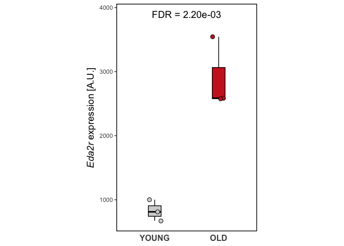<!-- -->

##### Rattus Norvegicus (GSE52550)

``` r
# Load the data
rat_ge_eda2r <- read.table("./data/rat/PRJNA516151/eda2r_exp.txt", sep = "\t", stringsAsFactors = FALSE, header = TRUE, row.names = 1)

# Set up colors: shades of red
color_shades <- c("#f4cccc", "#ea9999", "#e06666", "#cc0000", "#990000", "#660000")

# Create the bar plot
p_bar <- ggplot(rat_ge_eda2r, aes(x = rownames(rat_ge_eda2r), y = log2, fill = rownames(rat_ge_eda2r))) +
  geom_bar(stat = "identity", color = "black", width = 0.5) +  # Reduce the width of the bars to compress the x-axis
  scale_fill_manual(values = color_shades) +
  theme_bw() +
  labs(y = expression(italic("Eda2r") ~ "log"[2] ~ "FC vs baseline [6 months]"), x = NULL) +
  theme(
    axis.text.x = element_text(size = 12, face = "bold", angle = 45, hjust = 1),
    axis.title.y = element_text(size = 14, face = "bold"),
    panel.grid = element_blank(),
    panel.border = element_rect(color = "black", fill = NA, size = 1),
    legend.position = "none"
  ) +
  scale_x_discrete(labels = c("9 mths", "12 mths", "18 mths", "21 mths", "24 mths", "27 mths")) +
  geom_text(aes(label = ifelse(fdr < 0.05, paste0("q=", formatC(fdr, format = "e", digits = 1)), ifelse(log2 < 0, "ns", "ns"))), 
            vjust = ifelse(rat_ge_eda2r$log2 < 0, -2, -0.5), size = 3, color = "black", fontface = "bold") +  # Adjust position for "ns"
  ylim(-0.5, 4) +  # Adjust the y-axis to accommodate the labels
  geom_hline(yintercept = 0, color = "black", linetype = "solid", size = 0.5) +  # Add the intercept line at y=0
  coord_fixed(ratio = 1.5)  # Compress the x-axis by increasing the aspect ratio

# Display the plot
p_bar
```

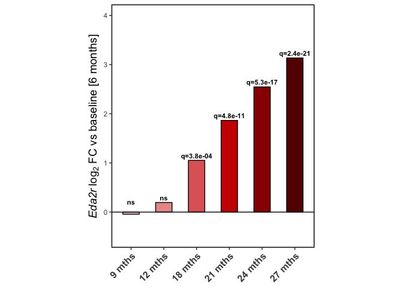<!-- -->

<br>
